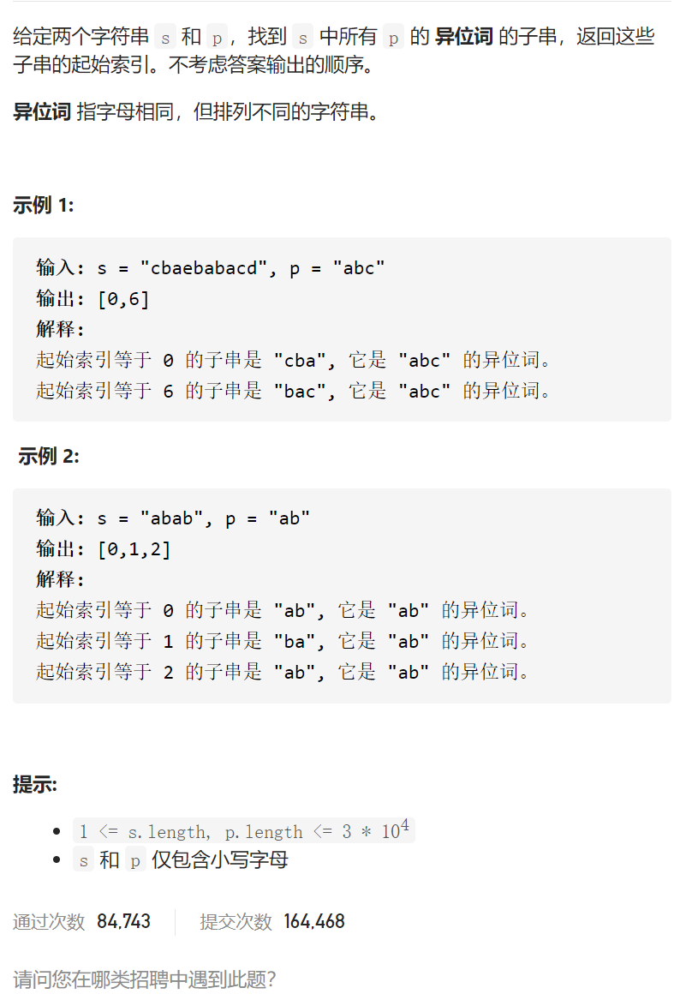

找到字符串中所有字母异位词

变量简洁正确完整思路

固定间隔为3的窗口，substr得到sub，对p得到sortP，如果sub等于p不行，否则sortsub比较是否相同、

```c
class Solution {
public:
    vector<int> findAnagrams(string s, string p) {
        int len=p.size();
        string sortP=p;
        vector<int>ans;
        sort(sortP.begin(),sortP.end());
        for(int i=0;i+len-1<s.size();i++){
            string sub=s.substr(i,len);
            sort(sub.begin(),sub.end());
            if(sub==sortP)ans.push_back(i);
        }
        return ans;
    }
};

```


变量简洁正确完整思路

不满足可以right++left++，不到m个可以right++

unordered_map<char,int>window2cnt，need2cnt，

判断是否满足的方法是window2cnt和need2cnt中的相同个数same==need2cnt.size()

先写框架

```c
class Solution {
public:
    vector<int> findAnagrams(string s, string p) {
        unordered_map<char,int>window2cnt,need2cnt;
        int left=0,right=0;
        int same=0;
        int s.size()=n;
        for(char c:p)need2cnt[c]++;
        while(right<n){

            window2cnt[s[right]]++;
            if(window2cnt[s[right]]==need2cnt[s[right]])same++;
            right++;
            

            if(window2cnt[s[left]==need2cnt[s[left]])same--;
            window2cnt[s[left]]--;
            left++;
        }
    }
};

```


debug


```c
class Solution {
public:
    vector<int> findAnagrams(string s, string p) {
        unordered_map<char,int>window2cnt,need2cnt;
        int left=0,right=0;
        int same=0;
        int n=s.size();
        int m=p.size();
        for(char c:p)need2cnt[c]++;
        cout<<need2cnt.size()<<endl;
        vector<int>ans;
        while(right<n){

            window2cnt[s[right]]++;
            if(need2cnt.count(s[right])&&window2cnt[s[right]]==need2cnt[s[right]])same++;
            right++;
            //cout<<left<<' '<<right<<' '<<same<<endl;
            if(right-left==m){
                //cout<<need2cnt.size()<<endl;
                if(same==need2cnt.size())ans.push_back(left);
                if(need2cnt.count(s[left])&&window2cnt[s[left]]==need2cnt[s[left]])same--;
                window2cnt[s[left]]--;
                left++;
            }
        }
        return ans;
    }
};
```


踩过的坑

 if(need2cnt.count(s[right])&&window2cnt[s[right]]==need2cnt[s[

用[]必须小心如果不存在，因为[]是没有就插入