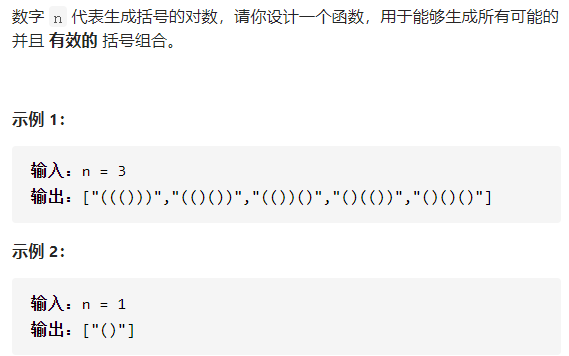
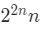

括号生成



详细思路

尝试添加（，进入下一层，或者不要）而尝试添加（，进入下一层，当长度为两倍时检查，检测从头开始，如果左边括号一旦少于右边括号就是错的，复杂度

精确定义

curArr当前已经添加的括号

depth当前正在处理第几个字符

m长度的两倍

balance当前左边括号比右边多的个数

c当前判断的字符

ans全部有效的数组

```c

class Solution {
public:
    vector<string> generateParenthesis(int n) {
        vector<string>ans;
        string curArr;
        tryAdd(n*2,ans,curArr,0);
        return ans;
    }
    void tryAdd(int m,vector<string>&ans,string curArr,int depth){
        if(depth==m){
            if(isValid(curArr)){
                ans.push_back(curArr);
            }
            return;
        }
        curArr.push_back('(');
        tryAdd(m,ans,curArr,depth+1);
        curArr.pop_back();
        curArr.push_back(')');
        tryAdd(m,ans,curArr,depth+1);
    }
    bool isValid(string curArr){
        int balance=0;
        for(auto c:curArr){
            if(c=='(')balance++;
            if(c==')')balance--;
            if(balance<0)return false;
        }
        if(balance==0)return true;
        else return false;
    }
};


```


详细思路

如果左括号个数小于n才添加左括号，如果右括号小于左括号才添加右括号

精确定义

cntLeft当前已经添加的左括号个数

cntRight当前已经添加的右括号个数

```c
class Solution {
public:
    vector<string> generateParenthesis(int n) {
        vector<string>ans;
        string curArr;
        tryAdd(n*2,ans,curArr,0,0,0);
        return ans;
    }
    void tryAdd(int m,vector<string>&ans,string curArr,int depth,int cntLeft,int cntRight){
        if(depth==m){
            if(isValid(curArr)){
                ans.push_back(curArr);
            }
            return;
        }
        if(cntLeft<m/2){
            curArr.push_back('(');
            cntLeft++;
            tryAdd(m,ans,curArr,depth+1,cntLeft,cntRight);
            curArr.pop_back();
            cntLeft--;
        }
        if(cntRight<cntLeft){
            curArr.push_back(')');
            cntRight++;
            tryAdd(m,ans,curArr,depth+1,cntLeft,cntRight);
        }

    }
    bool isValid(string curArr){
        int balance=0;
        for(auto c:curArr){
            if(c=='(')balance++;
            if(c==')')balance--;
            if(balance<0)return false;
        }
        if(balance==0)return true;
        else return false;
    }
};
```

