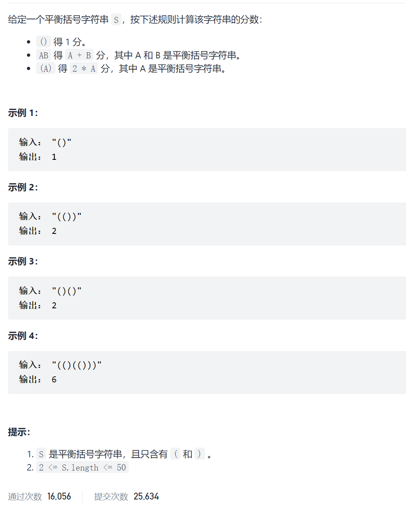
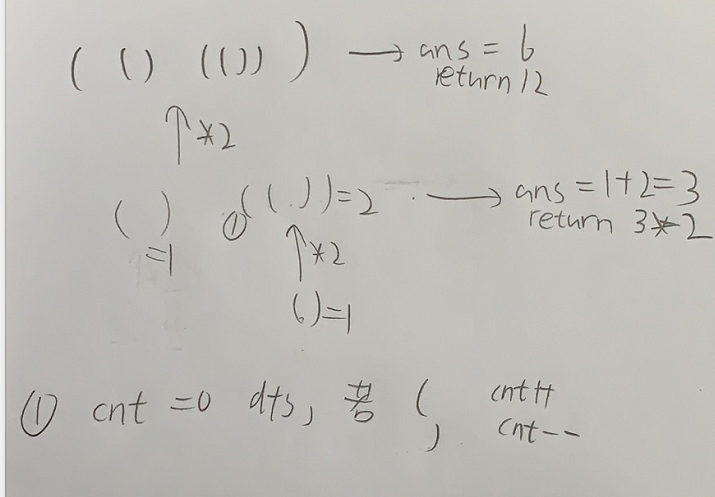

括号的分数



抽象图一二ij



```c
class Solution {
public:
    int scoreOfParentheses(string s) {
        return dfs(s)/2;
    }
    int dfs(string s){
        int i=0;
        int add=0;
        while(i<s.size()){
            int j=i;
            int cnt=1;
            i++;
            while(i<s.size()&&cnt>0){
                if(s[i]=='(')cnt++;
                else if(s[i]==')')cnt--;
                i++;
            }
            if(i==j+2)add++;
            else add+=dfs(s.substr(j+1,i-j-2));
        }
        return add*2;
    }
};
```

