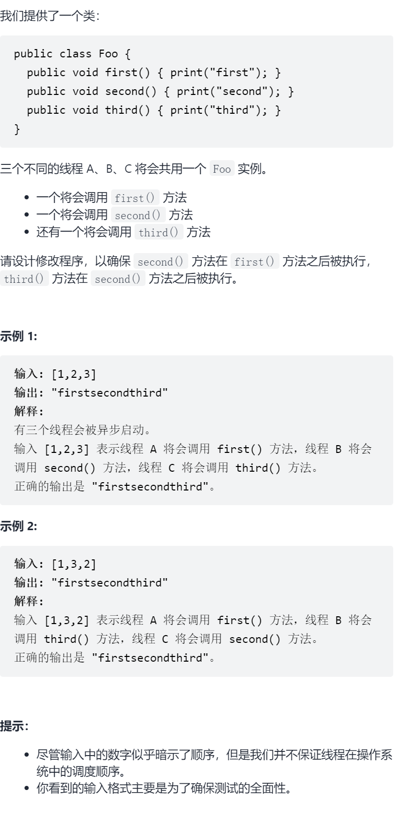

c按序打印



抽象图一二ij


信号量等待通知

```c
#include<semaphore.h>
class Foo {
    sem_t firstOk,secondOk;
public:
    Foo() {
        sem_init(&firstOk,0,0);
        sem_init(&secondOk,0,0);
    }
    void first(function<void()> printFirst) {
        printFirst();

        sem_post(&firstOk);
    }
    void second(function<void()> printSecond) {
        sem_wait(&firstOk);

        printSecond();

        sem_post(&secondOk);
    }
    void third(function<void()> printThird) {
        sem_wait(&secondOk);
        
        printThird();
    }
};
```

互斥锁卡住直到释放

```c
class Foo {
    mutex mtx1,mtx2;
public:
    Foo() {
        mtx1.lock();
        mtx2.lock();
    }
    void first(function<void()> printFirst) {
        printFirst();
        mtx1.unlock();
    }
    void second(function<void()> printSecond) {
        mtx1.lock();
        printSecond();
        mtx1.unlock();
        mtx2.unlock();
    }
    void third(function<void()> printThird) {
        mtx2.lock();
        printThird();
        mtx2.unlock();
    }
};
```

看cppreference说最好使用unique_lock/lock_guard/scoped_lock来管理mutex，

防止未定义行为

```c
class Foo {
    mutex mtx1,mtx2;
    unique_lock<mutex>lock1,lock2;
public:
    Foo():lock1(mtx1,try_to_lock),lock2(mtx2,try_to_lock){
    }
    void first(function<void()> printFirst) {
        printFirst();
        lock1.unlock();
    }
    void second(function<void()> printSecond) {
        lock_guard<mutex>guard(mtx1);
        printSecond();
        lock2.unlock();
    }
    void third(function<void()> printThird) {
        lock_guard<mutex>guard(mtx2);
        printThird();
    }
};
```

条件变量

```c
class Foo {
    condition_variable cv;
    mutex mtx;
    bool processed1,processed2;
public:
    Foo() {
        processed1=false;
        processed2=false;
    }
    void first(function<void()> printFirst) {
        printFirst();
        processed1=true;
        cv.notify_all();
    }
    void second(function<void()> printSecond) {
        unique_lock<mutex>locker(mtx);
        cv.wait(locker,[this]{return this->processed1;});
        printSecond();
        processed2=true;
        cv.notify_all();
    }
    void third(function<void()> printThird) {
        unique_lock<mutex>locker(mtx);
        cv.wait(locker,[this]{return this->processed2;});
        printThird();
    }
};

```

异步操作

```c
class Foo {
    promise<void>pro1,pro2;
public:
    Foo() {
    }
    void first(function<void()> printFirst) {
        printFirst();
        pro1.set_value();
    }
    void second(function<void()> printSecond) {
        pro1.get_future().wait();
        printSecond();
        pro2.set_value();
    }
    void third(function<void()> printThird) {
        pro2.get_future().wait();
        printThird();
    }
};

class Foo {
    function<void()>task=[](){};
    packaged_task<void()>pt1{task},pt2{task};
public:
    Foo() {
    }
    void first(function<void()> printFirst) {
        printFirst();
        pt1();
    }
    void second(function<void()> printSecond) {
        pt1.get_future().wait();
        printSecond();
        pt2();
    }
    void third(function<void()> printThird) {
        pt2.get_future().wait();
        printThird();
    }
};
```

原子操作

```c
class Foo {
    atomic<bool>a{false};
    atomic<bool>b{false};
public:
    Foo() {
    }
    void first(function<void()> printFirst) {
        printFirst();
        a=true;
    }
    void second(function<void()> printSecond) {
        while(!a)this_thread::sleep_for(chrono::milliseconds(1));
        printSecond();
        b=true;
    }
    void third(function<void()> printThird) {
        while(!b)this_thread::sleep_for(chrono::milliseconds(1));
        printThird();
    }
};
```

