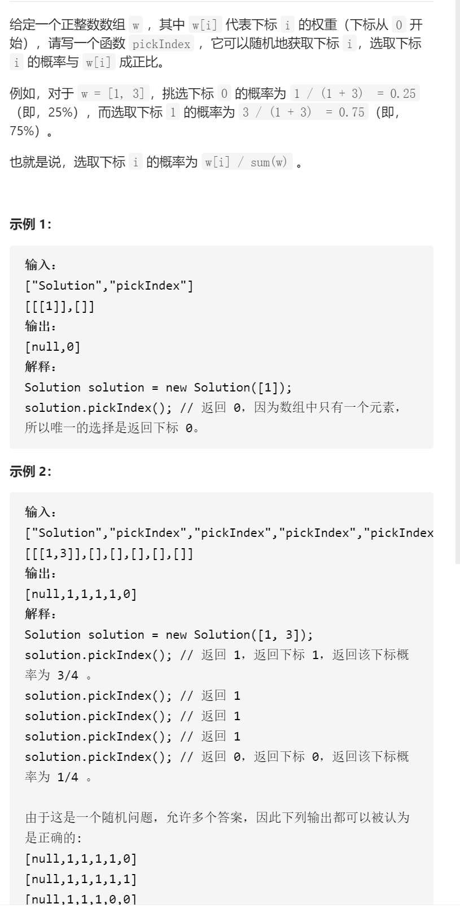
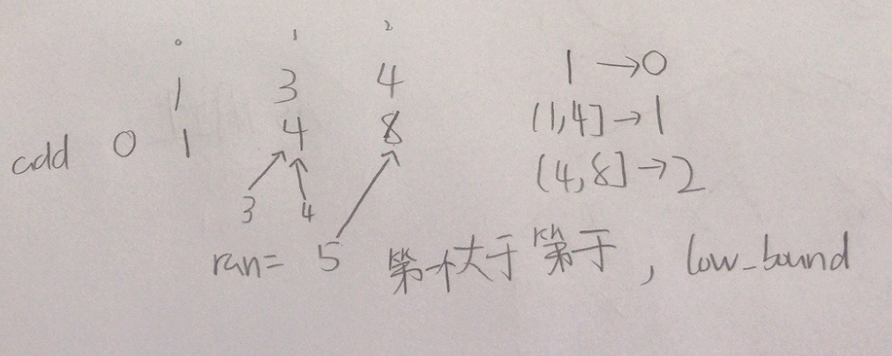

按权重随机选择



抽象图固定维护寻找



```c

class Solution {
public:
    vector<int>add;
    Solution(vector<int>& w) {

        add.resize(w.size()+1,0);
        for(int i=1;i<=w.size();i++)add[i]=w[i-1]+add[i-1];
    }
    
    int pickIndex() {

        int ran=rand()%add.back()+1;
        return lower_bound(add.begin(),add.end(),ran)-add.begin()-1;
    }
};


class Solution {
public:
    vector<int>add;
    Solution(vector<int>& w) {

        add.resize(w.size()+1,0);
        for(int i=1;i<=w.size();i++)add[i]=w[i-1]+add[i-1];
    }
    
    int pickIndex() {

        int ran=rand()%add.back()+1;
        int left=0,right=add.size()-1;
        while(left<right){
            int mid=left+(right-left)/2;
            if(add[mid]>=ran)right=mid;
            else left=mid+1;
        }
        return left-0-1;
    }
};
```

