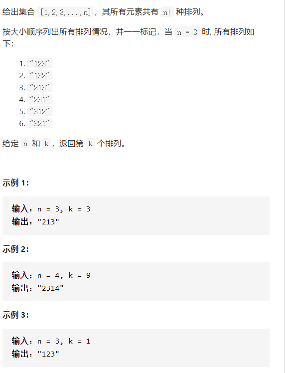

排列序列

详细思路

dfs，对于每一个深度也就是下标为深度的数需要判断，如果depth==n cnt++；如果cnt是第k个数就返回这个数列，枚举1-n，放进ans，或者不要，vis数组防止使用同一个数

精确定义

depth深度也是第depth个数

```c
class Solution {
public:
    int cnt=0;
    string ans;
    string getPermutation(int n, int k) {
        string ans1;
        vector<int>vis(n,0);
        dfs(n,k,0,ans1,vis);
        return ans;
    }
    void dfs(int n,int k,int depth,string ans1,vector<int>&vis){
        if(depth==n){
            cnt++;
            if(cnt==k){
                ans=ans1;
                return ;
            }
        }
        if(cnt>k)return;
        for(int i=1;i<=n;i++){
            if(vis[i-1])continue;
            ans1.push_back(i+'0');
            vis[i-1]=1;
            dfs(n,k,depth+1,ans1,vis);
            vis[i-1]=0;
            ans1.pop_back();
        }
    }
};
```


踩过的坑

​    if(cnt>k)return;

必须有这句话，因为后面还会有很多大于k的过来，哪怕你在==k时已经return了

