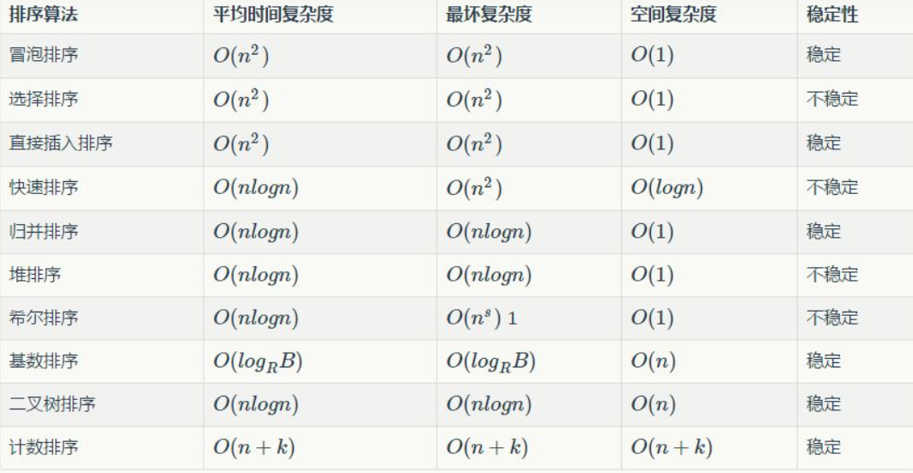

**稳定性的意义**

1、如果只是简单的进行数字的排序，那么稳定性将毫无意义。

2、如果排序的内容仅仅是一个复杂对象的某一个数字属性，那么稳定性依旧将毫无意义（所谓的交换操作的开销已经算在算法的开销内了，如果嫌弃这种开销，不如换算法好了？）

3、如果要排序的内容是一个复杂对象的多个数字属性，但是其原本的初始顺序毫无意义，那么稳定性依旧将毫无意义。

4、除非要排序的内容是一个复杂对象的多个数字属性，且其原本的初始顺序存在意义，那么我们需要在二次排序的基础上保持原有排序的意义，才需要使用到稳定性的算法，例如要排序的内容是一组原本按照价格高低排序的对象，如今需要按照销量高低排序，使用稳定性算法，可以使得想同销量的对象依旧保持着价格高低的排序展现，只有销量不同的才会重新排序。（当然，如果需求不需要保持初始的排序意义，那么使用稳定性算法依旧将毫无意义）。

**工业界的意义**

**1. 排序数值关联到其他信息，并且其他信息也会影响到顺序**

**2. 排序算法影响到程序的健壮性**

**3. 多次排序，想要延续以前排序顺序**