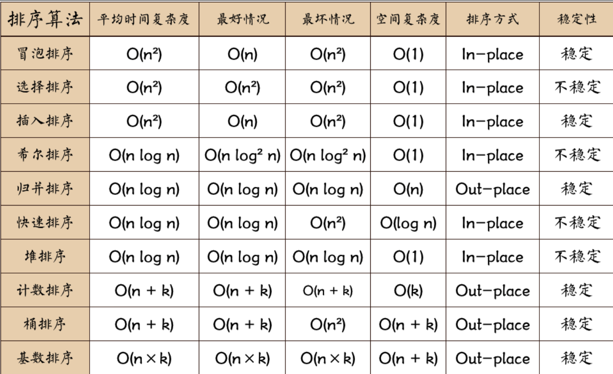

冒泡选择插入希尔堆


堆排序为原地排序，常量级额外空间 

```c
 public static void heap(int []a,int parent,int len){
        int temp=a[parent];
        int child=2*parent+1; //获得左孩子
        while(child<len){
            if(child+1<len&&a[child+1]>a[child])
                child++;
            if(a[child]<=temp)
                break;
            a[parent]=a[child];
            parent=child;        //孩子结点为父节点
            child=child*2+1;    //孩子结点为当前结点的左结点
        }
        a[parent]=temp;
    }
    

    public static void heapSort(int a[]){
        for(int i=a.length/2-1;i>=0;i--)
            heap(a,i,a.length);
        for(int i=a.length-1;i>0;i--){
            int temp=a[0];
            a[0]=a[i];
            a[i]=temp;
            heap(a,0,i);
        }
        
    }


```

