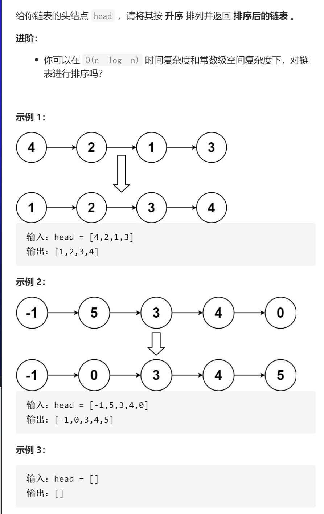
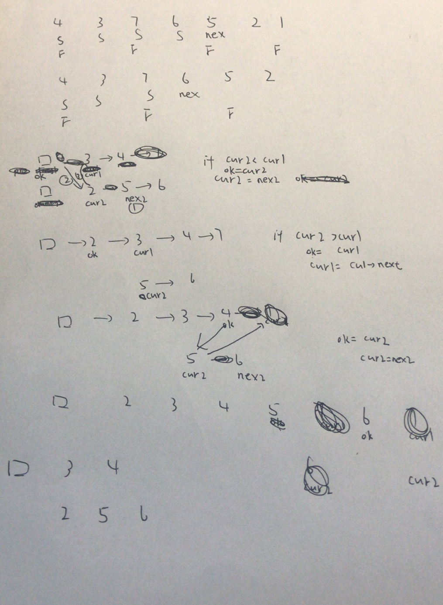
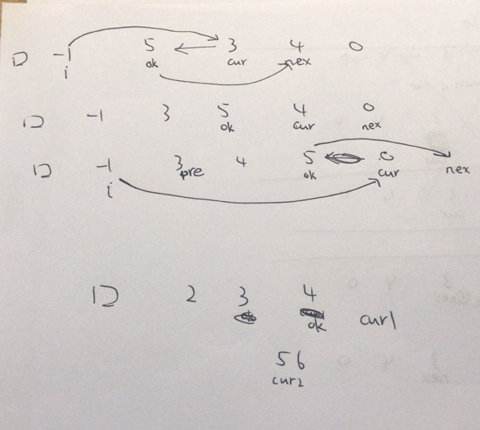

排序链表



变量简洁正确完整思路

找中点分成两个子链表，对两个子链表排序，合并两个有序链表，dfs形参head得到head链表的有序链表，head为空或head->next为空边界返回，再对dfs返回两个有序链表进行合并，

画图



```c
class Solution {
public:
    ListNode* sortList(ListNode* head) {
        return dfs(head);
    }
    ListNode*dfs(ListNode*head){
        if(!head||!head->next)return head;
        ListNode*S=head,*F=head;
        while(F->next&&F->next->next){
            F=F->next->next;
            S=S->next;
        }
        ListNode*nex=S->next;
        S->next=nullptr;
        ListNode*cur1=dfs(head);
        ListNode*cur2=dfs(nex);
        ListNode*dummy=new ListNode(-1,cur1);
        ListNode*ok=dummy;
        while(cur1&&cur2){
            if(cur2->val<cur1->val){
                ListNode*nex2=cur2->next;
                ok->next=cur2;
                cur2->next=cur1;
                ok=cur2;
                cur2=nex2;
            }else {
                ok=cur1;
                cur1=cur1->next;
            }
        }
        if(cur2)ok->next=cur2;
        return dummy->next;
    }
};
```

