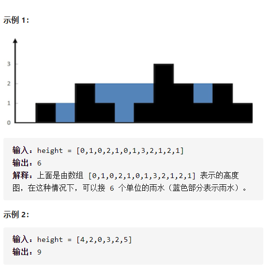

接雨水



详细思路

对于下标i雨水，=左右两边最大高度的较小值-height[i]，怎么求得左右两边最大高度的较小值，对于i节点左边的最大高度，一遍从左往右遍历，不断更新最大值，同理i节点右边的最大高度；遍历每个位置获取每个下标的雨水量，加入答案

精确定义

leftMax[i]下标i左边包括i的最大高度，也是需要判断

rightMax[i]下标i右边包括下标i的最大高度，也是需要判断

最后一遍i，需要判断当前位置雨水

```c
class Solution {
public:
    int trap(vector<int>& height) {
        int n=height.size();
        if(n<3)return 0;
        vector<int>leftMax(n,0);
        vector<int>rightMax(n,0);
        int ans=0;
        leftMax[0]=height[0];
        rightMax[n-1]=height[n-1];
        for(int i=1;i<n;i++){
            leftMax[i]=max(leftMax[i-1],height[i]);
        }
        for(int j=n-2;j>=0;j--){
            rightMax[j]=max(rightMax[j+1],height[j]);
        }
        for(int i=1;i<n-1;i++){
            ans+=min(leftMax[i],rightMax[i])-height[i];
        }
        return ans;
    }
};
```


详细思路

当后面的柱子高度低于前面，不用计算，当找到一根高度高于前面，计算并pop，使用单调递减栈，更低柱子下标push，遇到高于栈顶的柱子，只要while是高于栈顶的就要pop出来并结算这个

精确定义

stk.pop拿出来后需要结算的

i需要处理的，如果小于等于直接push，如果大于，需要结算

结算：拿出来的下标为left，left之前的下标为top，长宽


```c
class Solution {
public:
    int trap(vector<int>& height) {
        int n=height.size();
        if(n<3)return 0;
        stack<int>stk;
        int ans=0;
        for(int i=0;i<n;i++){
            while(!stk.empty()&&height[i]>height[stk.top()]){
                int left=stk.top();
                stk.pop();
                if(stk.empty())break;
                ans+=(i-stk.top()-1)*(min(height[stk.top()],height[i])-height[left]);
            }
            stk.push(i);
        }
        return ans;
    }
};
```

踩过的坑

​        stk.pop();

ans+=(i-stk.top()-1)*(min(height[stk.top()],height[i])-height[left]);

无论如何，都是先pop出来再需要处理，不要先处理再pop