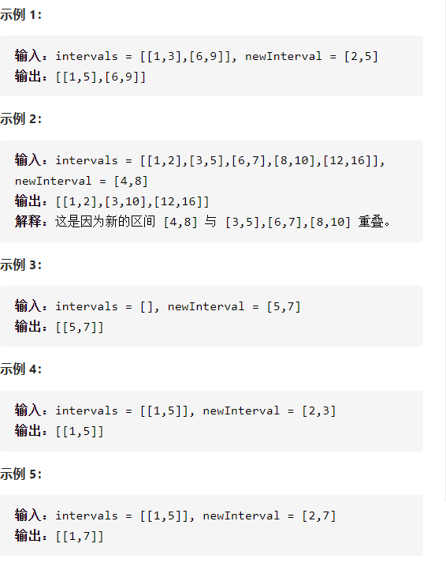

插入区间



详细思路

遍历，如果在左边且无交集，放进答案，如果在右边且无交集，放进答案，如果有交集，更新newInterval的left和right让它扩大，最后把扩大的哪一个按良好的顺序放进答案

精确定义

i需要判断的下标

left right已经扩大

```c
class Solution {
public:
    vector<vector<int>> insert(vector<vector<int>>& intervals, vector<int>& newInterval) {

        vector<vector<int>>ans;
        int left=newInterval[0],right=newInterval[1];
        bool placed=false;
        for(int i=0;i<intervals.size();i++){
            if(intervals[i][1]<left)ans.push_back(intervals[i]);
            else if(intervals[i][0]>right){
                if(!placed){
                    ans.push_back({left,right});
                    placed=true;
                }
                ans.push_back(intervals[i]);
            }
            else {
                left=min(left,intervals[i][0]);
                right=max(right,intervals[i][1]);
            }
        }
        if(!placed)ans.push_back({left,right});
        return ans;
    }
};

```


踩过的坑

第一次没交集且遍历到了右边就必须插入，vector可不能插入中间，用placed在判断