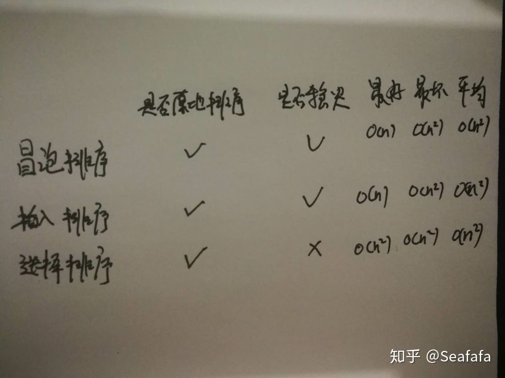

## 解答开篇

基本的知识都讲完了，我们来看开篇的问题：冒泡排序和插入排序的时间复杂度都是O(n^2),都是原地排序算法，为什么插入排序要比冒泡排序更受欢迎呢？

我们前面分析冒泡排序和插入排序的时候讲到，冒泡排序不管怎么优化，元素交换的次数是一个固定值，是原始数据的逆序度。插入排序是同样的，不管怎么优化，元素移动的次数也等于原始数据的逆序度。

但是，从代码实现上来看，冒泡排序的数据交换要比插入排序的数据移动要复杂，冒泡排序需要3个赋值操作，而插入排序只需要一个。我们来看这段操作：

```cpp
//冒泡排序中数据的交换操作：
if(a[j] > a[j+1]) 
{
	int tmp = a[j]; //交换
	a[j] = a[j+1];
	a[j+1] = tmp;
	flag = true;
}

//插入排序中的数据移动操作
if(a[j] > value)
{
	a[j+1] = a[j];//数据移动
		
}
else
{
	break;
}
```

我们把执行一个赋值语句的时间粗略地计为单位时间（unit_time），然后分别用冒泡排序和插入排序对同一个逆序度是K的数组进行排序。用冒泡排序，需要k次交换操作，每次需要3个赋值语句，所以交换操作总耗时是3*k单位时间。而插入排序中数据移动操作只需要K个单位时间。

这个只是我们非常理论的分析，为了实验，针对上面的冒泡排序和插入排序的java代码，我写了一个性能对比测试程序，随机生成10000个数组，每个数组中包含200个数据，然后在我的机器上分别用冒泡和插入排序算法来排序，冒泡排序算法大约700ms才能执行完成，而插入排序只需要100ms左右就能搞定。

所以，虽然冒泡排序和插入排序在时间复杂度上是一样的，都是O(n^2),但是如果我们希望把性能优化做到极致，那肯定首选插入排序。插入排序的算法思路也有很大的优化空间，我们只是讲了最基础的一种。如果你对插入排序的优化感兴趣，可以自行学习一下希尔排序。

## 内容小结

要想分析，评价一个排序算法，需要从执行效率，内存消耗和稳定性三个方面来看，因此，这一节，我带你分析了三种时间复杂度是O(n^2)的排序算法，冒泡排序，插入排序，选择排序。你需要重点掌握的是他们的分析方法。



这三种时间复杂度为O(n^2)的排序算法中，冒泡排序，选择排序，可能就纯粹停留在理论的层面了，学习的目的也只是为了开拓思维，实际开发中应用并不多，但是插入排序还是停有用的。后面讲排序优化的时候，我会讲到，有些编程语言中的排序函数的实现原理会用到插入排序算法。

今天讲的这三种排序算法，实现代码都非常简单，对于小规模数据的排序，用起来非常高效。但是在大规模数据排序的时候，这个时间复杂度还是稍微有点高，所以我们更倾向与用下一节要讲的时间复杂度为O(nlogn)的排序算法。