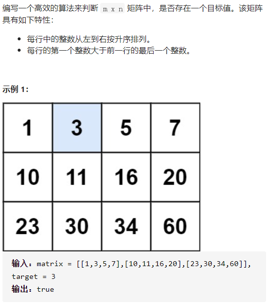
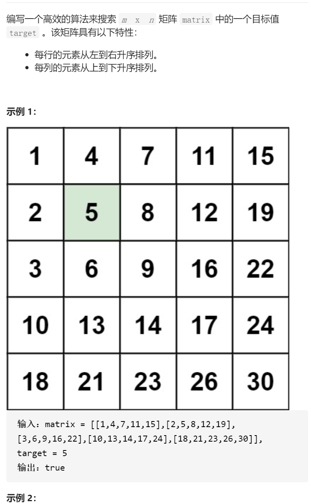
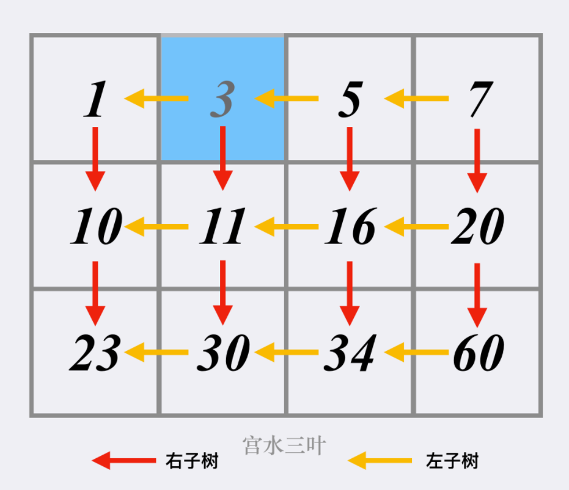

搜索二维矩阵



详细思路

二分，left=0，right=n*m-1,mid=left+(right-left)/2，将mid映射为ij，j=mid%m; i=mid/m

```c
class Solution {
public:
    bool searchMatrix(vector<vector<int>>& matrix, int target) {
        int n=matrix.size(),m=matrix[0].size();
        int left=0,right=n*m-1;
        while(left<=right){
            int mid=left+(right-left)/2;
            int i=mid/m,j=mid%m;
            if(matrix[i][j]==target){
                return true;
            }
            else if(matrix[i][j]<target)left=mid+1;
            else if(matrix[i][j]>target)right=mid-1;
        }
        return false;
    }
};
```

踩过的坑

​    while(left<=right){

left等于right一般要判断，否则就是等于直接离开

------

搜索二维矩阵II


变量简洁正确完整思路

从右上角开始，等于返回，小于左边，大于右边，像二叉搜索树



```c
class Solution {
public:
    bool searchMatrix(vector<vector<int>>& matrix, int target) {
        int n=matrix.size(),m=matrix[0].size();
        for(int i=0;i<n;){
            for(int j=m-1;j>=0;){
                if(matrix[i][j]==target)return true;
                else if(matrix[i][j]>target){
                    if(j==0)return false;
                    j--;
                }
                else if(matrix[i][j]<target){
                    if(i==n-1)return false;
                    i++;
                }
            }
        }
        return false;
    }
};
```


