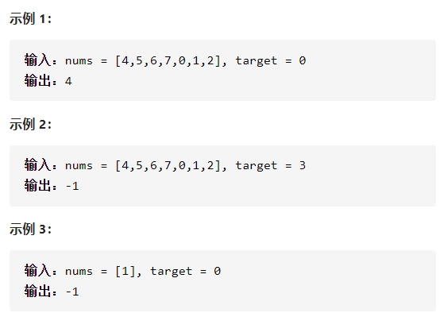

搜索旋转排序数组



详细思路

二分查找，如果mid是直接返回，如果left==mid直接返回，

否则必须找到一个非递减数组，判断target是否在其中，

进入或者排除这个数组

精确定义

left左边数组第一个

mid左边数组最后一个，右边数组第一个

right右边数组最后一个

```c
class Solution {
public:
    int search(vector<int>& nums, int target) {
        int n=nums.size();
        if(n==1)return nums[0]==target?0:-1;
        int left=0,right=n-1;
        while(left<=right){
            int mid=left+(right-left)/2;
            if(nums[mid]==target)return mid;
            if(left==mid){
                if(nums[left]==target)return left;
                else if(nums[right]==target)return right;
                else return -1;
            }
            if(nums[left]<nums[mid]){
                if(nums[left]<=target&&target<nums[mid])right=mid-1;
                else left=mid+1;
            }
            else if(nums[mid]<nums[right]){
                if(nums[mid]<target&&target<=nums[right])left=mid+1;
                else right=mid-1;
            }
        }
        return -1;
    }
};
```


踩过的坑

​      if(left==mid){

​        if(nums[left]==target)return left;

​        else if(nums[right]==target)return right;

​        else return -1;

​      }

left==mid，输出，之后就是3个元素以上的数组，只需要找到一个

非递减的就好了，小心10111无法判断

