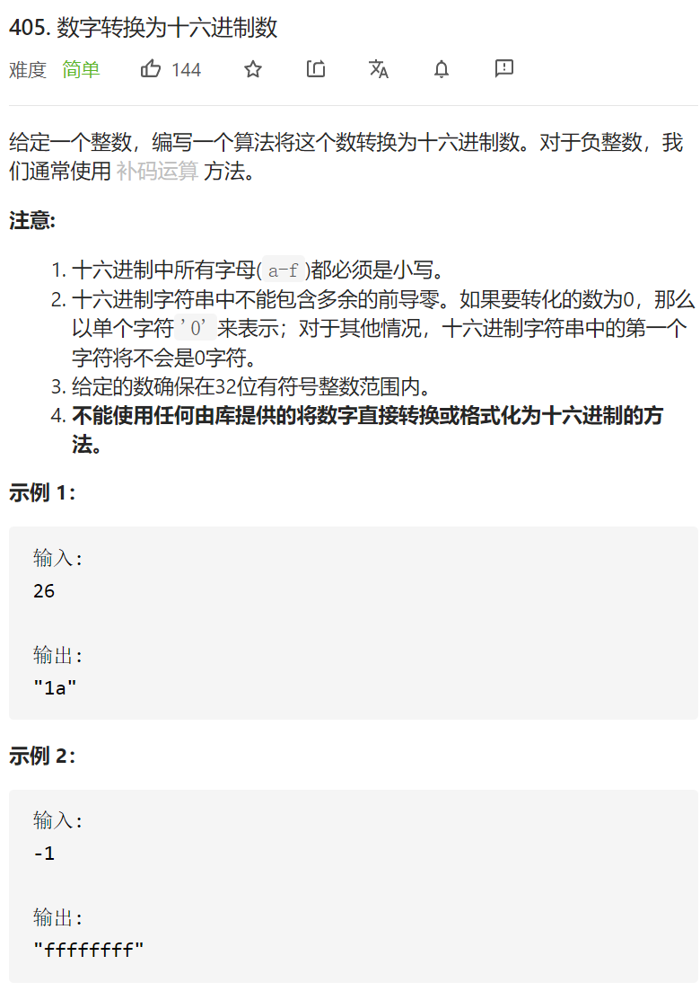

数字转换为十六进制数



变量简洁正确完整思路

固定低4位映射出十六进制并更新答案

```c
class Solution {
public:
    string toHex(int num) {
        unsigned int n=num;
        string num2char="0123456789abcdef";
        string ans;
        while(n!=0){
            int tmp=(n&0xf);
            n>>=4;
            ans.push_back(num2char[tmp]);
        }
        reverse(ans.begin(),ans.end());
        return ans;
    }
};
```

踩过的坑

负整数十进制的符号到了二进制就是最高位1，就是补码表示，只要原封不动的把这些二进制转化成十六进制就是补码

-17：11111111111111111111111111101111

不支持左移和逻辑右移，支持算术右移>>=3，也就是左边补符号位

11111111111111111111111111111101

先unsigned int转化，就支持逻辑右移，要的就是逻辑右移不要在左边添加符号位

