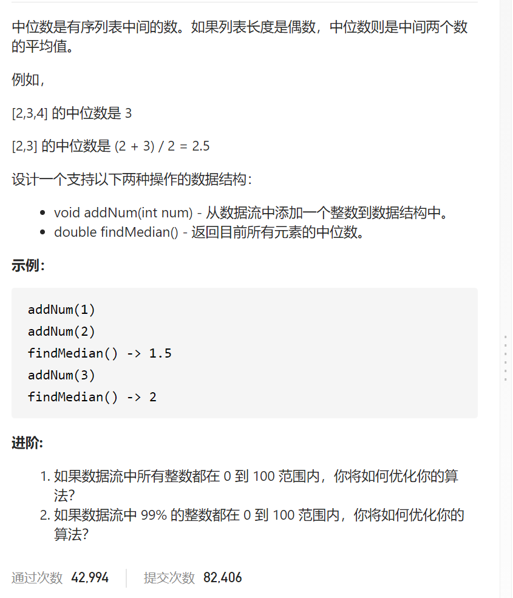

数据流的中位数




插入排序，往已经排好序的插入一个元素就用插入排序

```c
class MedianFinder {
public:
    vector<int>nums;
    /** initialize your data structure here. */
    MedianFinder() {

    }
    
    void addNum(int num) {
        nums.push_back(num);
        int tmp=num;
        int i=nums.size()-2;
        while(i>=0&&nums[i]>tmp){
            nums[i+1]=nums[i];
            i--;
        }
        nums[i+1]=tmp;
    }
    
    double findMedian() {
        int n=nums.size();
        for(auto a:nums)cout<<a<<' ';
        cout<<endl;
        if(n%2==1)return nums[n/2];
        else return (nums[n/2-1]+nums[n/2])*0.5;
    }
};

/**
 * Your MedianFinder object will be instantiated and called as such:
 * MedianFinder* obj = new MedianFinder();
 * obj->addNum(num);
 * double param_2 = obj->findMedian();
 */
```


大小堆，nums较小一半放在最大堆，较大一半放在最小堆，则中位数容易

如何维护大小堆各一半？123456

1先放到max，在pop到min，如果min多了一个，pop到max，

2先放到max，在pop到min，如果min相同，不变

类似于 1       1     12    1      13     1     12

​          1               2       2     23     3

```c
class MedianFinder {
public:
    priority_queue<int>max;
    priority_queue<int,vector<int>,greater<int>>min;
    /** initialize your data structure here. */
    MedianFinder() {

    }
    
    void addNum(int num) {
        max.push(num);
        min.push(max.top());
        max.pop();
        if(max.size()==min.size()-1){
            max.push(min.top());
            min.pop();
        }
    }
    
    double findMedian() {
        if(max.size()==min.size())return 0.5*(max.top()+min.top());
        else return max.top();
    }
};
```


平衡二叉搜索树

low high迭代器指向中位数，

奇数  123   指向2

偶数  1234   指向23

奇数   123   插入num=3>*low   1234  low2   high3

​                 num=2==*low  1223  low2  high2

​                 num=1<*low   1123  low 1  high 2

偶数   1234   插入num=1<*low   11234  low=high=2

​                  num=2==low   12234  low=high=2

​                  num=3==high   12334  low=high=3

​                   num=4>*high   12344  low=high=3

​                   num=2.5       122.534  low=high=2.5

```c
class MedianFinder {
public:
    multiset<int>rbtree;
    multiset<int>::iterator low,high;
    /** initialize your data structure here. */
    MedianFinder() {
    }
    
    void addNum(int num) {
        if(!rbtree.size()){
            rbtree.insert(num);
            low=rbtree.begin();
            high=rbtree.begin();
        }
        else {
            int n=rbtree.size();
            rbtree.insert(num);
            if(n&1){
                if(num>*low)high++;
                else if(num==*low)high++;
                else low--;
            }else {
                if(num<*low)high--;
                else if(num==*low)low++,high--;
                else if(num>*low&&num<*high)low++,high--;
                else if(num==*high)low++;
                else if(num>*high)low++;
            }
        }
    }
    
    double findMedian() {
        return low==high?*low:(*low+*high)*0.5;
    }
};

/**
 * Your MedianFinder object will be instantiated and called as such:
 * MedianFinder* obj = new MedianFinder();
 * obj->addNum(num);
 * double param_2 = obj->findMedian();
 */
```


踩过的坑

stl保障排序稳定性123 插入2，则1223第二个2才是插入的2，第一个2是原本的2

 else if(num>*low&&num<*high)low++,high--;