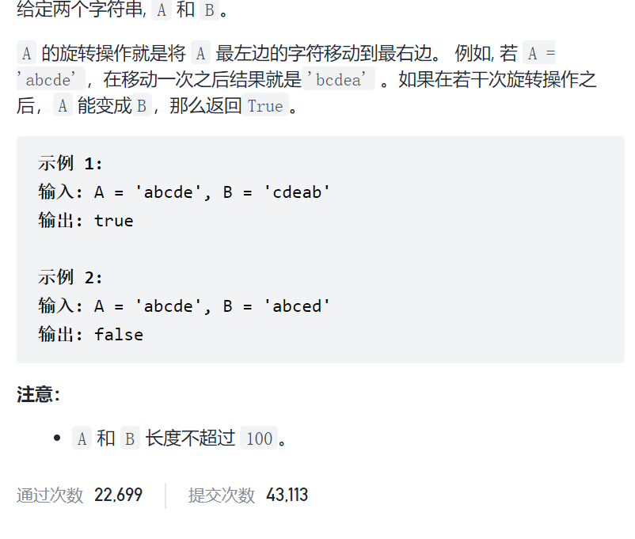

旋转字符串



抽象图一二ij


```c
class Solution {
public:
    bool rotateString(string s, string goal) {
        if(s.size()!=goal.size())return false;
        string doubleS=s+s;
        int idx=doubleS.find(goal);
        if(idx!=-1)return true;
        return false;
    }
};
```

