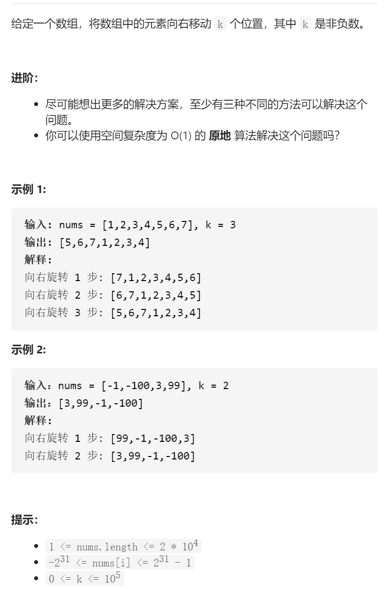

旋转数组



遍历简洁正确完整思路

k%=n；对于 1 2 3 4 5 6 7 k=3 reverse，7 6 5 4 3 2 1 ，reverse（begin,begin+k)

5 6 7 4 3 2 1 reverse（begin+k，end）

```c
class Solution {
public:
    void rotate(vector<int>& nums, int k) {
        k%=nums.size();
        reverse(nums.begin(),nums.end());
        reverse(nums.begin(),nums.begin()+k);
        reverse(nums.begin()+k,nums.end());
    }
};
```

踩过的坑

nums.end()不是最后一个元素，而是再往后的空下标