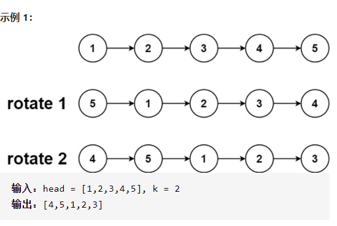
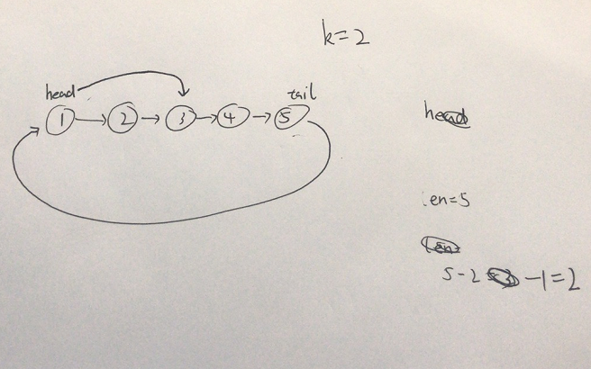

旋转链表



详细思路

遍历得到长度len同时闭合为环，继续找到切开的点

画图



精确定义

head

tail已经判断

newHead

len

for 需要走几步，i没有意义，单纯for是为了求出需要走几步

```c

class Solution {
public:
    ListNode* rotateRight(ListNode* head, int k) {
        if(head==nullptr)return nullptr;
        ListNode*tail=head;
        int len=1;
        while(tail->next){
            tail=tail->next;
            len++;
        }
        tail->next=head;
        k%=len;
        for(int i=0;i<len-k-1;i++){
            head=head->next;
        }
        ListNode*newHead=head->next;
        head->next=nullptr;
        return newHead;
    }
};
```

