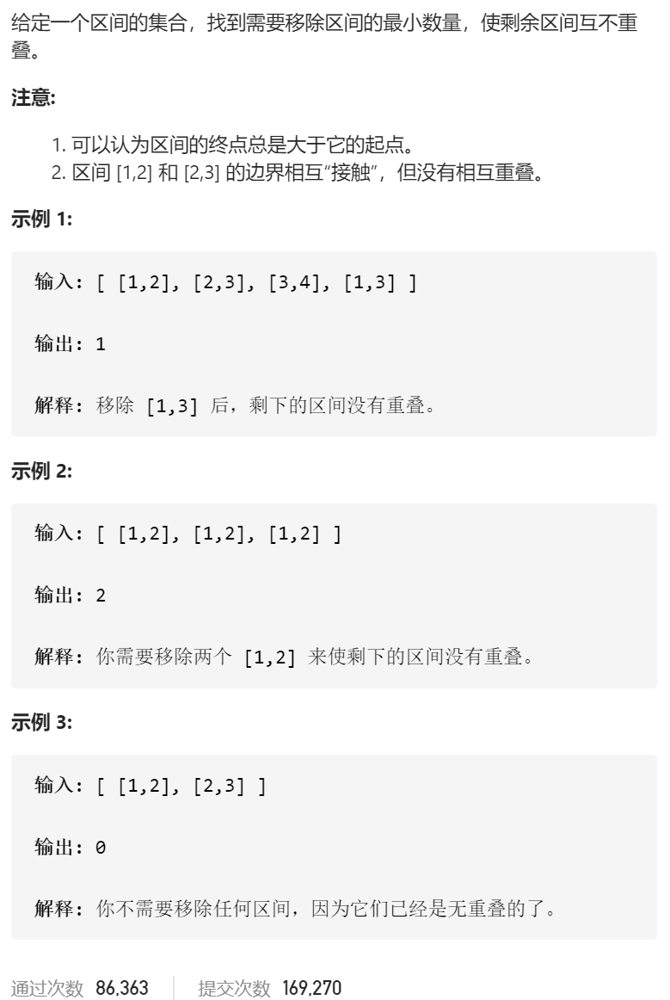
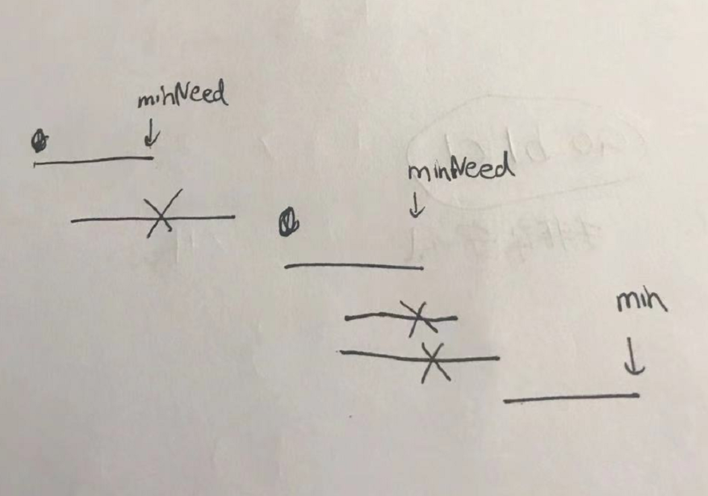

无重叠区间



变量简洁正确完整思路

按第一位排序，如果相同按第二位排序，然后遍历，看看1,3后跳过多少个到3,5，固定i，minNeed，判断·是否符合，更新minNeed，lambda自定义sort

按照minNeed的最长上升子序列



```c
class Solution {
public:
    int eraseOverlapIntervals(vector<vector<int>>& intervals) {
        sort(intervals.begin(),intervals.end(),[](const vector<int>&l,const vector<int>&r){
            if(l[0]==r[0])return l[1]<r[1];
            else return l[0]<r[0];
        });
        int ans=0;
        int minNeed=intervals[0][1];
        //for(auto vec:intervals){
        //    cout<<vec[0]<<' '<<vec[1]<<endl;
        //}
        //cout<<endl;
        for(int i=1;i<intervals.size();i++){
            //cout<<minNeed<<' '<<i<<' '<<ans<<endl;
            if(intervals[i][0]>=minNeed){
                minNeed=intervals[i][1];
            }else ans++;
            minNeed=min(minNeed,intervals[i][1]);
        }
        return ans;
    }
};
```


踩过的坑

一直都需要维护最小的minNeed，哪怕是不合适的让ans++的