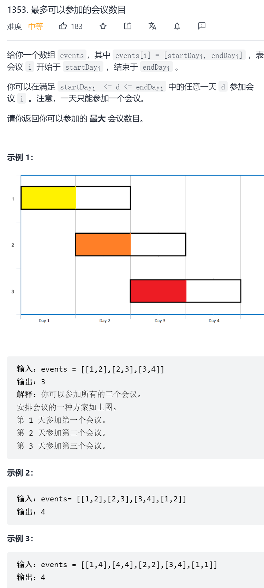

解题思路：
贪心的思想，对于第 ii 天，如果有若干的会议都可以在这一天开，那么我们肯定是让 endDayendDay 小的会议先在这一天开才会使答案最优，因为 endDayendDay 大的会议可选择的空间是比 endDayendDay 小的多的，所以在满足条件的会议需要让 endDayendDay 小的先开。

我们开两个数组和一个 setset：

in[i]in[i]：表示在第 ii 天开始的会议
out[i]out[i]：表示在第 ii 天有些会议结束了
set<pair<int,int> >:set<pair<int,int>>:存放当前时间下可以开的会议，用 (endDay_i,i)(endDay 
i

 ,i) 这个二元组标记。
即对于第 xx 个会议，我们在 in[events[x][0]]in[events[x][0]] 和 out[events[x][1]+1]out[events[x][1]+1] 处加入 xx，则我们从按时间从小往大扫过去，对于第 ii 天我们遍历 in[i]in[i]，把第 ii 天开始的会议全部加入 setset，再遍历 out[i]out[i]，把这一天结束的会议全部从 setset 里拿出来。相当于对于会议 xx，它在第 events[x][0]events[x][0] 天加入 setset，直到第 events[x][1]+1events[x][1]+1 天才会被抹去，那么我们根据这个就可以知道第 ii 天的所有可以开的会议就都在 setset 里了。

最后基于我们上面分析的贪心的思想，我们直接从 setset 里拿出 endDayendDay 最小的会议，然后删除，表示在第 ii 天我们开了这个会议即可，setset 内部是有序的，可以直接 O(1)O(1) 取出我们要的会议，当然这里也可以用别的数据结构来替代我们的 setset，比如优先队列，它们支持的都是 O(1)O(1) 取出最小值，O(logn)O(logn) 插入删除，这样可以保证时间复杂度是正确的。

C++

```c
class Solution {
public:
    #define N 100010
    #define MP make_pair
    multiset<pair<int,int> >S;
    vector<int>in[N],out[N];
    int maxEvents(vector<vector<int>>& events) {
        int mx=0,cnt=0;
        for (auto x:events){
            int l=x[0],r=x[1];
            mx=max(mx,r);
            in[l].push_back(cnt);
            out[r+1].push_back(cnt);
            cnt++;
        }
        int ans=0;
        for (int i=1;i<=mx;++i){
            for (auto x:in[i]) S.insert(MP(events[x][1],x));
            for (auto x:out[i]){
                auto it=S.find(MP(events[x][1],x));
                if (it!=S.end()) S.erase(it);
            }
            if (!S.empty()){
                S.erase(S.begin());
                ans++;
            }
        }
        return ans;
    }
};
```

复杂度分析

时间复杂度：O(Slogn)O(Slogn)，S=max_{i=0}^{events.length-1}{evens[i][1]}S=max 
i=0
events.length−1

 evens[i][1]，即时间点的上界，setset 插入删除均要 lognlogn 的时间。
空间复杂度：O(S)O(S)。

