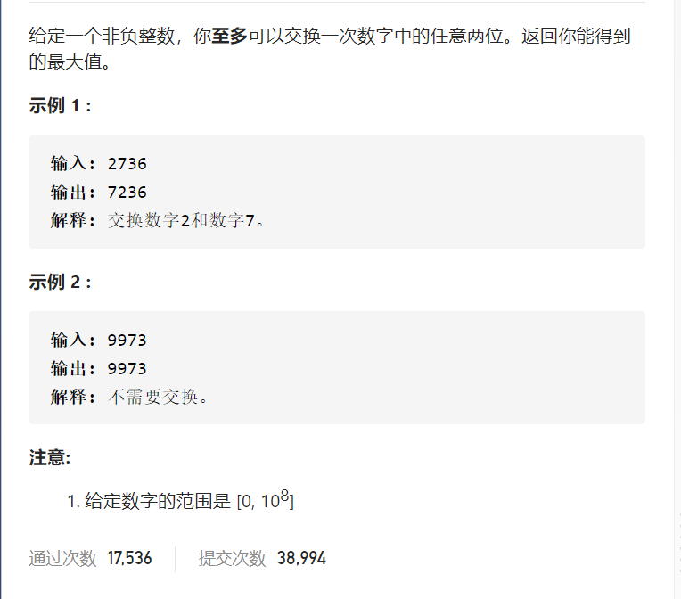
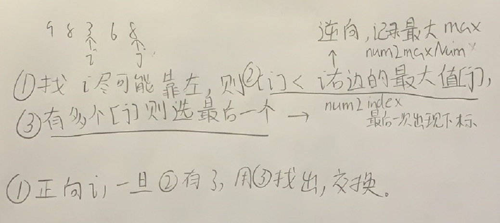

最大交换



抽象图一二ij

10^8 logn



```c
class Solution {
public:
    int maximumSwap(int num) {
        unordered_map<char,int>num2maxNum;
        unordered_map<char,int>num2index;
        string strNum=to_string(num);
        int n=strNum.size();
        char maxNum=INT_MIN;
        for(int i=n-1;i>=0;i--){
            if(strNum[i]<maxNum){
                num2maxNum[strNum[i]]=maxNum;
            }
            maxNum=max(maxNum,strNum[i]);
        }
        for(int i=n-1;i>=0;i--){
            if(num2index.count(strNum[i])==0)num2index[strNum[i]]=i;
        }
        for(int i=0;i<n-1;i++){
            if(num2maxNum.count(strNum[i])){
                swap(strNum[i],strNum[num2index[num2maxNum[strNum[i]]]]);
                break;
            }
        }
        return stoi(strNum);
    }
};
```

