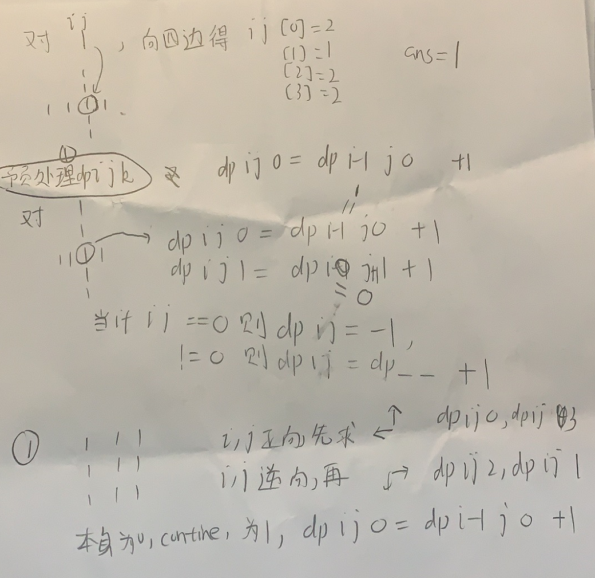

抽象图一二ij

```c

class Solution {
public:
    int orderOfLargestPlusSign(int n, vector<vector<int>>& mines) {
        vector<vector<vector<int>>>dp(n,vector<vector<int>>(n,vector<int>(4,0)));
        for(int i=0;i<mines.size();i++){
            for(int j=0;j<4;j++){
                dp[mines[i][0]][mines[i][1]][j]=-1;
            }
        }
        set<pair<int,int>>minesSet;
        for(int i=0;i<mines.size();i++){
            minesSet.insert({mines[i][0],mines[i][1]});
        }
        for(int i=0;i<n;i++){
            for(int j=0;j<n;j++){
                if(i-1<0||j-1<0||minesSet.count({i,j}))continue;
                dp[i][j][0]=dp[i-1][j][0]+1;
                dp[i][j][3]=dp[i][j-1][3]+1;
            }
        }
        for(int i=n-1;i>=0;i--){
            for(int j=n-1;j>=0;j--){
                if(j+1==n||i+1==n||minesSet.count({i,j}))continue;
                dp[i][j][1]=dp[i][j+1][1]+1;
                dp[i][j][2]=dp[i+1][j][2]+1;
            }
        }
        int ans=-1;
        for(int i=0;i<n;i++){
            for(int j=0;j<n;j++){
                ans=max(ans,min(min(min(dp[i][j][0],dp[i][j][1]),dp[i][j][2]),dp[i][j][3]));
            }
        }
        return ans+1;
    }
};
```

