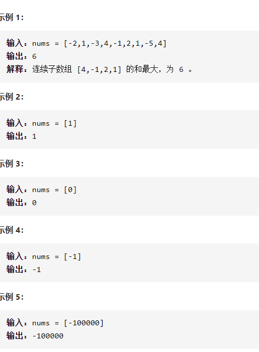

最大子序和



详细思路

前i个有某种递归关系

精确定义

dp i 以i为结尾的最大子序和，dp0是下标为0的数，nums0是下标为0的数

状态转移

\- - 1 dpi =max(dp[i-1]+nums[i],nums[i])

初始化

dp 0=nums[0]

```c
class Solution {
public:
    int maxSubArray(vector<int>& nums) {
        int n=nums.size();
        if(n==1)return nums[0];
        vector<int>dp(n);
        int ans=nums[0];
        dp[0]=nums[0];
        for(int i=1;i<n;i++){
            dp[i]=max(dp[i-1]+nums[i],nums[i]);
            ans=max(ans,dp[i]);
        }
        return ans;
    }
};

```

压缩，dpi1在最后应该保存dpi，这样就不用数组了

```c
class Solution {
public:
    int maxSubArray(vector<int>& nums) {
        int n=nums.size();
        if(n==1)return nums[0];
        int ans=nums[0];
        int dpi1=nums[0];
        for(int i=1;i<n;i++){
            int dpi=max(dpi1+nums[i],nums[i]);
            ans=max(ans,dpi);
            dpi1=dpi;
        }
        return ans;
    }
};
```


