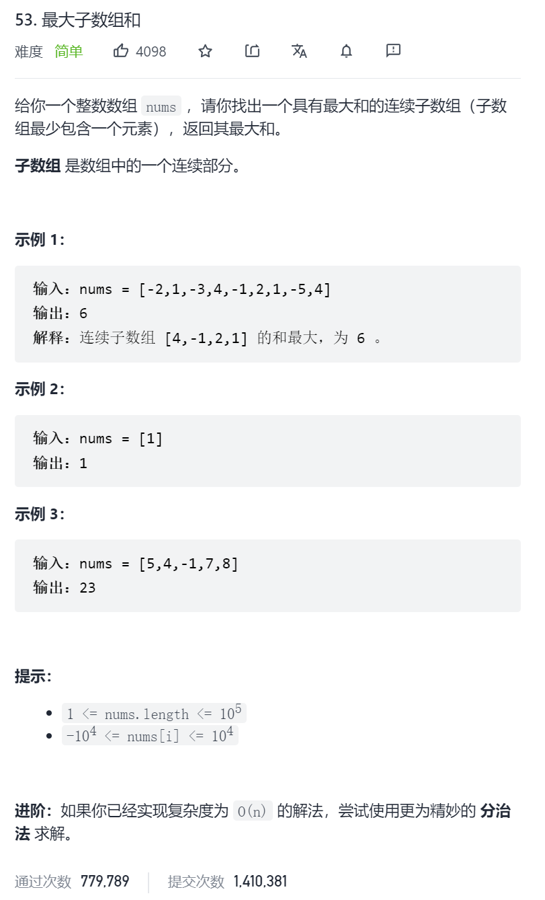

方法一：动态规划
思路和算法

假设 \textit{nums}nums 数组的长度是 nn，下标从 00 到 n-1n−1。

我们用 f(i)f(i) 代表以第 ii 个数结尾的「连续子数组的最大和」，那么很显然我们要求的答案就是：

\max_{0 \leq i \leq n-1} \{ f(i) \}
0≤i≤n−1
max

 {f(i)}

因此我们只需要求出每个位置的 f(i)f(i)，然后返回 ff 数组中的最大值即可。那么我们如何求 f(i)f(i) 呢？我们可以考虑 \textit{nums}[i]nums[i] 单独成为一段还是加入 f(i-1)f(i−1) 对应的那一段，这取决于 \textit{nums}[i]nums[i] 和 f(i-1) + \textit{nums}[i]f(i−1)+nums[i] 的大小，我们希望获得一个比较大的，于是可以写出这样的动态规划转移方程：

f(i) = \max \{ f(i-1) + \textit{nums}[i], \textit{nums}[i] \}
f(i)=max{f(i−1)+nums[i],nums[i]}

不难给出一个时间复杂度 O(n)O(n)、空间复杂度 O(n)O(n) 的实现，即用一个 ff 数组来保存 f(i)f(i) 的值，用一个循环求出所有 f(i)f(i)。考虑到 f(i)f(i) 只和 f(i-1)f(i−1) 相关，于是我们可以只用一个变量 \textit{pre}pre 来维护对于当前 f(i)f(i) 的 f(i-1)f(i−1) 的值是多少，从而让空间复杂度降低到 O(1)O(1)，这有点类似「滚动数组」的思想。

代码

```c
class Solution {
public:
    int maxSubArray(vector<int>& nums) {
        int pre = 0, maxAns = nums[0];
        for (const auto &x: nums) {
            pre = max(pre + x, x);
            maxAns = max(maxAns, pre);
        }
        return maxAns;
    }
};

作者：LeetCode-Solution
链接：https://leetcode-cn.com/problems/maximum-subarray/solution/zui-da-zi-xu-he-by-leetcode-solution/
来源：力扣（LeetCode）
著作权归作者所有。商业转载请联系作者获得授权，非商业转载请注明出处。
```

复杂度

时间复杂度：O(n)O(n)，其中 nn 为 \textit{nums}nums 数组的长度。我们只需要遍历一遍数组即可求得答案。
空间复杂度：O(1)O(1)。我们只需要常数空间存放若干变量。
方法二：分治
思路和算法

这个分治方法类似于「线段树求解最长公共上升子序列问题」的 pushUp 操作。 也许读者还没有接触过线段树，没有关系，方法二的内容假设你没有任何线段树的基础。当然，如果读者有兴趣的话，推荐阅读线段树区间合并法解决多次询问的「区间最长连续上升序列问题」和「区间最大子段和问题」，还是非常有趣的。

我们定义一个操作 get(a, l, r) 表示查询 aa 序列 [l,r][l,r] 区间内的最大子段和，那么最终我们要求的答案就是 get(nums, 0, nums.size() - 1)。如何分治实现这个操作呢？对于一个区间 [l,r][l,r]，我们取 m = \lfloor \frac{l + r}{2} \rfloorm=⌊ 
2
l+r

 ⌋，对区间 [l,m][l,m] 和 [m+1,r][m+1,r] 分治求解。当递归逐层深入直到区间长度缩小为 11 的时候，递归「开始回升」。这个时候我们考虑如何通过 [l,m][l,m] 区间的信息和 [m+1,r][m+1,r] 区间的信息合并成区间 [l,r][l,r] 的信息。最关键的两个问题是：

我们要维护区间的哪些信息呢？
我们如何合并这些信息呢？
对于一个区间 [l,r][l,r]，我们可以维护四个量：

\textit{lSum}lSum 表示 [l,r][l,r] 内以 ll 为左端点的最大子段和
\textit{rSum}rSum 表示 [l,r][l,r] 内以 rr 为右端点的最大子段和
\textit{mSum}mSum 表示 [l,r][l,r] 内的最大子段和
\textit{iSum}iSum 表示 [l,r][l,r] 的区间和
以下简称 [l,m][l,m] 为 [l,r][l,r] 的「左子区间」，[m+1,r][m+1,r] 为 [l,r][l,r] 的「右子区间」。我们考虑如何维护这些量呢（如何通过左右子区间的信息合并得到 [l,r][l,r] 的信息）？对于长度为 11 的区间 [i, i][i,i]，四个量的值都和 \textit{nums}[i]nums[i] 相等。对于长度大于 11 的区间：

首先最好维护的是 \textit{iSum}iSum，区间 [l,r][l,r] 的 \textit{iSum}iSum 就等于「左子区间」的 \textit{iSum}iSum 加上「右子区间」的 \textit{iSum}iSum。
对于 [l,r][l,r] 的 \textit{lSum}lSum，存在两种可能，它要么等于「左子区间」的 \textit{lSum}lSum，要么等于「左子区间」的 \textit{iSum}iSum 加上「右子区间」的 \textit{lSum}lSum，二者取大。
对于 [l,r][l,r] 的 \textit{rSum}rSum，同理，它要么等于「右子区间」的 \textit{rSum}rSum，要么等于「右子区间」的 \textit{iSum}iSum 加上「左子区间」的 \textit{rSum}rSum，二者取大。
当计算好上面的三个量之后，就很好计算 [l,r][l,r] 的 \textit{mSum}mSum 了。我们可以考虑 [l,r][l,r] 的 \textit{mSum}mSum 对应的区间是否跨越 mm——它可能不跨越 mm，也就是说 [l,r][l,r] 的 \textit{mSum}mSum 可能是「左子区间」的 \textit{mSum}mSum 和 「右子区间」的 \textit{mSum}mSum 中的一个；它也可能跨越 mm，可能是「左子区间」的 \textit{rSum}rSum 和 「右子区间」的 \textit{lSum}lSum 求和。三者取大。
这样问题就得到了解决。

```c
class Solution {
public:
    struct Status {
        int lSum, rSum, mSum, iSum;
    };

    Status pushUp(Status l, Status r) {
        int iSum = l.iSum + r.iSum;
        int lSum = max(l.lSum, l.iSum + r.lSum);
        int rSum = max(r.rSum, r.iSum + l.rSum);
        int mSum = max(max(l.mSum, r.mSum), l.rSum + r.lSum);
        return (Status) {lSum, rSum, mSum, iSum};
    };

    Status get(vector<int> &a, int l, int r) {
        if (l == r) {
            return (Status) {a[l], a[l], a[l], a[l]};
        }
        int m = (l + r) >> 1;
        Status lSub = get(a, l, m);
        Status rSub = get(a, m + 1, r);
        return pushUp(lSub, rSub);
    }

    int maxSubArray(vector<int>& nums) {
        return get(nums, 0, nums.size() - 1).mSum;
    }
};

作者：LeetCode-Solution
链接：https://leetcode-cn.com/problems/maximum-subarray/solution/zui-da-zi-xu-he-by-leetcode-solution/
来源：力扣（LeetCode）
著作权归作者所有。商业转载请联系作者获得授权，非商业转载请注明出处。
```

复杂度分析

假设序列 aa 的长度为 nn。

时间复杂度：假设我们把递归的过程看作是一颗二叉树的先序遍历，那么这颗二叉树的深度的渐进上界为 O(\log n)O(logn)，这里的总时间相当于遍历这颗二叉树的所有节点，故总时间的渐进上界是 O(\sum_{i=1}^{\log n} 2^{i-1})=O(n)O(∑ 
i=1
logn

 2 
i−1
 )=O(n)，故渐进时间复杂度为 O(n)O(n)。
空间复杂度：递归会使用 O(\log n)O(logn) 的栈空间，故渐进空间复杂度为 O(\log n)O(logn)。
题外话
「方法二」相较于「方法一」来说，时间复杂度相同，但是因为使用了递归，并且维护了四个信息的结构体，运行的时间略长，空间复杂度也不如方法一优秀，而且难以理解。那么这种方法存在的意义是什么呢？

对于这道题而言，确实是如此的。但是仔细观察「方法二」，它不仅可以解决区间 [0, n-1][0,n−1]，还可以用于解决任意的子区间 [l,r][l,r] 的问题。如果我们把 [0, n-1][0,n−1] 分治下去出现的所有子区间的信息都用堆式存储的方式记忆化下来，即建成一颗真正的树之后，我们就可以在 O(\log n)O(logn) 的时间内求到任意区间内的答案，我们甚至可以修改序列中的值，做一些简单的维护，之后仍然可以在 O(\log n)O(logn) 的时间内求到任意区间内的答案，对于大规模查询的情况下，这种方法的优势便体现了出来。这棵树就是上文提及的一种神奇的数据结构——线段树。

