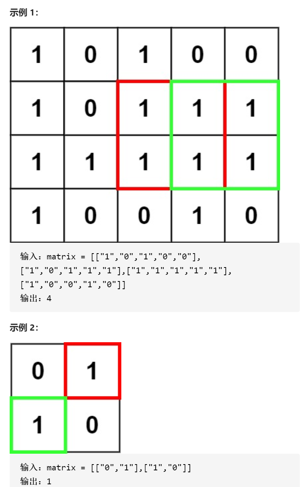

最大正方形



变量简洁正确完整思路

精确定义

dpij 右下角ij的全是1的正方形边长最大值，dp00是空dp11是第一个

转移

0 1 1 1 0

1 1 1 1 0

0 1 1 1 1 

0 0 0 1 1 

if num = 1  dp ij=min dpi-1 j dp i j-1 dp i-1 j-1   +1

if num =0   dp ij=0

初始化

dp i0=0 dp0 j=0  

```c
class Solution {
public:
    int maximalSquare(vector<vector<char>>& matrix) {
        int n=matrix.size(),m=matrix[0].size();
        vector<vector<int>>dp(n+1,vector<int>(m+1,0));
        int ans=0;
        for(int i=1;i<=n;i++){
            for(int j=1;j<=m;j++){
                if(matrix[i-1][j-1]=='0')dp[i][j]=0;
                else if(matrix[i-1][j-1]=='1'){
                    dp[i][j]=min(dp[i-1][j-1],min(dp[i-1][j],dp[i][j-1]))+1;
                    ans=max(ans,dp[i][j]*dp[i][j]);
                }
            }
        }
        return ans;
    }
};
```

状态压缩，哪怕一边是i，一边是i-1和i也可以状态压缩

```c
class Solution {
public:
    int maximalSquare(vector<vector<char>>& matrix) {
        int n=matrix.size(),m=matrix[0].size();

        vector<vector<int>>dp(2,vector<int>(m+1,0));
        int ans=0;
        for(int i=1;i<=n;i++){
            for(int j=1;j<=m;j++){
                if(matrix[i-1][j-1]=='0')dp[i%2][j]=0;
                else if(matrix[i-1][j-1]=='1'){
                    dp[i%2][j]=min(dp[(i-1)%2][j-1],min(dp[(i-1)%2][j],dp[i%2][j-1]))+1;
                    ans=max(ans,dp[i%2][j]*dp[i%2][j]);
                }
            }
        }
        return ans;
    }
};
```

