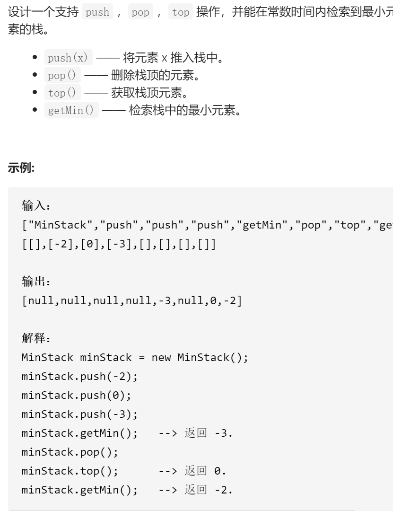

最小栈



变量简洁正确完整思路

一个栈stk和一个同步最小栈minStk，当pushstk，val与minStktop比较，较小的push进minStk，当popstk，popminStk，当top时，返回stktop，当getMin时返回minStktop，另外一个思路是只用一个stk，元素是pair<int,int>当前值和最小值，push时最小值用min(val,stk.top().second)不过时空不变

```c
class MinStack {
public:
    /** initialize your data structure here. */
    MinStack() {
        minStk.push(INT_MAX);
    }
    void push(int val) {
        stk.push(val);
        minStk.push(min(val,minStk.top()));
    }
    
    void pop() {
        stk.pop();
        minStk.pop();
    }
    
    int top() {
        return stk.top();
    }
    
    int getMin() {
        return minStk.top();
    }
private:
    stack<int>stk,minStk;
};
```

