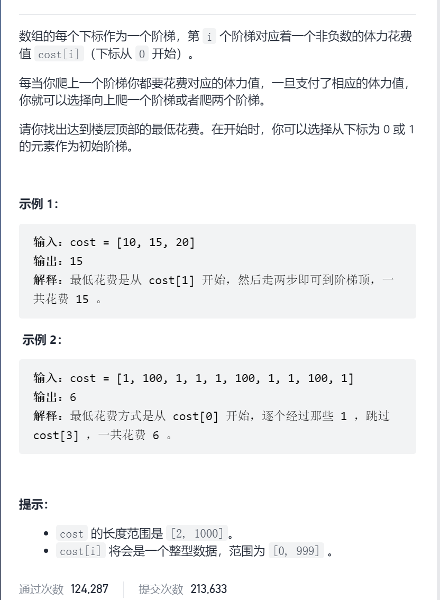
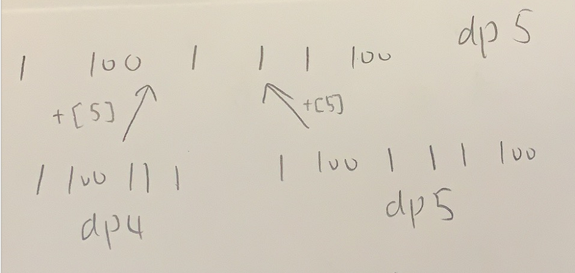

使用最小花费爬楼梯

抽象图一二ij



```c
class Solution {
public:
    int minCostClimbingStairs(vector<int>& cost) {

        int n=cost.size();
        vector<int>dp(n,INT_MAX);
        dp[0]=cost[0],dp[1]=cost[1];
        for(int i=2;i<n;i++){
            dp[i]=min(dp[i-2],dp[i-1])+cost[i];
        }
        return min(dp[n-1],dp[n-2]);
    }
};


class Solution {
public:
    int minCostClimbingStairs(vector<int>& cost) {

        int n=cost.size();
        vector<int>dp(3,INT_MAX);
        dp[0]=cost[0],dp[1]=cost[1];
        for(int i=2;i<n;i++){
            dp[i%3]=min(dp[(i-2)%3],dp[(i-1)%3])+cost[i];
        }
        return min(dp[(n-1)%3],dp[(n-2)%3]);
    }
};
```

