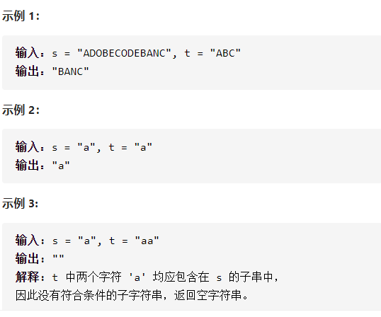

最小覆盖子串



详细思路

滑动窗口，窗口内所有字符用哈希表字符映射次数，另一个哈希表把第二个字符串处理好，right是窗口内最后一个元素，left是窗口第一个元素，先向右一步，然后只要检查成功就不断向左，再向右一步，直到不能再向右

精确定义

need

have

left

right

```c
class Solution {
public:
    unordered_map<char,int>need,have;
    string minWindow(string s, string t) {
        for(int i=0;i<t.size();i++){
            need[t[i]]++;
        }
        int left=0,right=-1,ans_len=0x3f3f3f3f,ans_beg=0;
        while(right<(int)s.size()){
            right++;
            have[s[right]]++;
            cout<<have[s[right]];
            while(check()&&left<=right){
                if(right-left+1<ans_len){
                    ans_len=right-left+1;
                    ans_beg=left;
                }
                have[s[left]]--;
                left++;              
            }
        }
        return ans_len==0x3f3f3f3f?"":s.substr(ans_beg,ans_len);
    }
    bool check(){
        for(auto mPair:need){
            auto it=have.find(mPair.first);
            if(it==have.end())return false;
            if(it->second<mPair.second)return false;
        }
        return true;
    }
};
```


踩过的坑

​    while(right<(int)s.size()){

-1和size()不能比较，因为size()返回unsigned int，

负数会先转化成一个极大的正数4294967295

每向右一步，只要能向左就一定要向左，因为答案是求最小窗口，所以

while(){向右，while(可以向左){向左}}