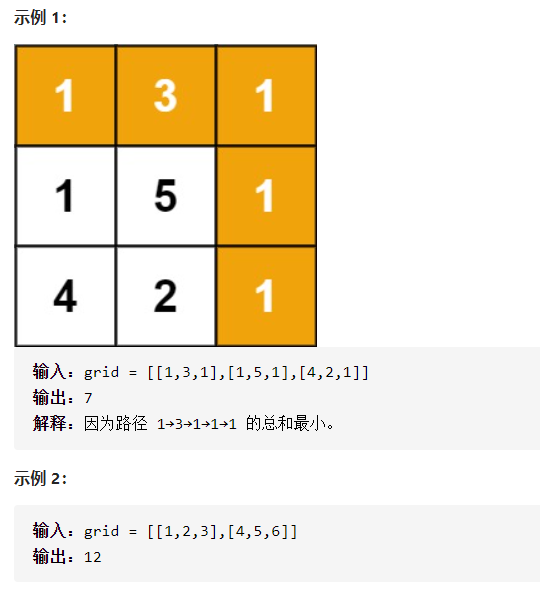

最小路径和详细思路

第ij最小只需要最小的i-1 j  i j-1 中的小的就行了

精确定义

dpi j dp00是第一行第一列，dpij是下标ij的格子的路径和最小

递推

\- - -

\- - -

\- - - dpij =min(dp[i-1][j],dp[i][j-1])+num[i][j]

初始化

dp i 0=dp i-1 0+num[i][0] 

dp 0 i =dp dp0 i-1+num[][]

```c
class Solution {
public:
    int minPathSum(vector<vector<int>>& grid) {
        int n=grid.size(),m=grid[0].size();
        vector<vector<int>>dp(n,vector<int>(m,0));
        dp[0][0]=grid[0][0];
        for(int i=1;i<n;i++){
            dp[i][0]=dp[i-1][0]+grid[i][0];
        }
        for(int j=1;j<m;j++){
            dp[0][j]=dp[0][j-1]+grid[0][j];
        }
        for(int i=1;i<n;i++){
            for(int j=1;j<m;j++){
                dp[i][j]=min(dp[i-1][j],dp[i][j-1])+grid[i][j];
            }
        }
        return dp[n-1][m-1];
    }
};
```

