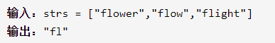
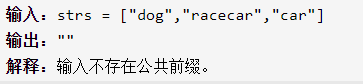

最长公共前缀

给字符串数组，找到最长的公共前缀并输出





详细思路

第一个字符串的大小作为当前最右下标，用第一个字符串依次和接下来字符串匹配最长前缀，每次从第一个开始字符匹配直到不能匹配，更新当前最长右下标，复杂度nm，n是个数，m是平均长度

精确定义

mostRight当前最长公共前缀最右下标，只能减少

right当前正在匹配的两字符串最右下标

i是正在匹配的字符串下标

str1是拿来匹配的第一个字符串

```c
class Solution {
public:
    string longestCommonPrefix(vector<string>& strs) {
        if(strs.size()==0)return "";
        string str1=strs[0];
        int mostRight=str1.size();
        for(int i=1;i<strs.size();i++){
            int right=-1;
            while(right+1<strs[i].size()&&right+1<=mostRight&&strs[i][right+1]==str1[right+1]){
                right++;
            }
            mostRight=right;
        }
        if(mostRight==-1)return "";
        return str1.substr(0,mostRight-0+1);
    }
};
```


