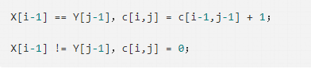
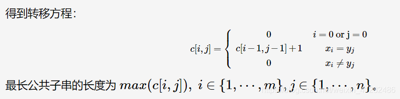

[](https://leetcode-cn.com/u/derek-45/)

最长公共连续子序列（最长公共子串）

关注用户

[derekL1](https://leetcode-cn.com/u/derek-45/)

发布于 2020-12-28

750 阅读

**问题描述**

给定两个序列X=<x1,x2,...,xm>和Y=<y1,y2,...,yn>，求X和Y的最长公共公共子序列。（连续子序列必须连续的）
例如：输入两个字符串 acbac和 acaccbabb，则最大连续子串为 “cba”, 则返回长度 3。

**动态规划**
时间复杂度O(M*N)，空间复杂度O(M*N)。

这个 LCS 跟前面说的最长公共子序列的 LCS 不一样，不过也算是 LCS 的一个变体，在 LCS 中，子序列是不必要求连续的，而子串则是 “连续” 的。

我们还是像之前一样 “从后向前” 考虑是否能分解这个问题，类似最长公共子序列的分析，这里，我们使用c[i,j] 表示 以 Xi 和 Yj 结尾的最长公共子串的长度，因为要求子串连续，所以对于 Xi 与 Yj 来讲，它们要么与之前的公共子串构成新的公共子串；要么就是不构成公共子串。故状态转移方程：

这里写图片描述




```c
#include <iostream>
#include <vector>

using namespace std;

class Solution {
public:
    int longestCommonSubstring(string str1, string str2) {
        int len1 = str1.length();
        int len2 = str2.length();
        vector<vector<int> > dp(len1 + 1, vector<int>(len2 + 1, 0));

        int result = 0;
        for (int i = 0; i <= len1; ++i) {
            for (int j = 0; j <= len2; ++j) {
                if (i == 0 || j == 0) {
                    dp[i][j] = 0;
                } else if (str1[i - 1] == str2[j - 1]) {
                    dp[i][j] = dp[i - 1][j -1] + 1;
                    result = max(dp[i][j], result);
                } else {
                    dp[i][j] = 0;
                }
            }
        }

        return result;
    }

};

int main(int argc, char *argv[]) {
    string str1("acbac");
    string str2("acaccbabb");

    Solution so;
    cout << so.longestCommonSubstring(str1, str2) << endl;

    return 0;
}
```