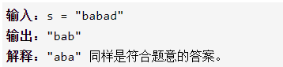

最长回文子串

输入一个字符串，找到回文、子串、最长，输出任意一个




详细思路

对于每一个起点，向右找到每一个终点，取出子串，比较翻转前和翻转后是否相同，相同更新答案，复杂度n3

精确定义

i子串起点

j子串终点

str1翻转前子串

str2翻转后子串

ans最长回文子串之一

```c
class Solution {
public:
    string longestPalindrome(string s) {

        string ans="";
        ans.push_back(s[0]);
        for(int i=0;i<s.size();i++){
            for(int j=i+1;j<s.size();j++){
                string str1,str2;
                str1=str2=s.substr(i,j-i+1);
                reverse(str2.begin(),str2.end());
                if(str1==str2)ans=(str1.size()>ans.size()?str1:ans);
            }
        }
        return ans;

    }
};
```


踩过的坑

substr需要起点和长度

详细思路

某一段子串可以从内部的子串转换过来，只需要两头相同，复杂度n2

精确定义

dpij i为第一个元素，j为最后一个元素的子串是否为回文子串

ans_i回文子串最长的第一个元素

ans_len回文子串最长长度

len当前遍历的长度

状态转移

a - - a dpij=dp i+1 j-1

a - - b dpij=false

初始化

dpii 一个元素=true

dpi i-1空子串=true

小于2个元素直接返回

遍历顺序

长度从小到大，再找到每个起点

```c
class Solution {
public:
    string longestPalindrome(string s) {
        int n=s.size();
        if(n<2)return s;
        int ans_i=0,ans_len=1;
        vector<vector<bool>>dp(n,vector<bool>(n));
        for(int i=1;i<n;i++){
            dp[i][i]=true;
            dp[i][i-1]=true;
        }
        dp[0][0]=true;
        for(int len=2;len<=n;len++){
            for(int i=0;i+len-1<n;i++){
                int j=i+len-1;
                if(s[i]==s[j]){
                    dp[i][j]=dp[i+1][j-1];
                    if(dp[i][j]&&len>ans_len)ans_i=i,ans_len=len;
                }
                else dp[i][j]=false;
            }
        }
        return s.substr(ans_i,ans_len);
    }
};
```


踩过的坑

​    for(int len=2;len<=n;len++){//如果从起点、终点遍历，会有断层dp0 4会发现dp 1 3还没有

​      for(int i=0;i+len-1<n;i++){

详细思路

遍历扩展起点，从1个和2个字符左右扩展，返回扩展后的回文串起点终点更新答案，小于二先返回

精确定义

ans_beg最长回文子串的第一个元素

ans_end最长回文子串的最后一个元素

i i 一个字符开始扩展的起点终点

i i+1两个字符开始扩展的起点终点

beg1 end1一个字符扩展后回文串的第一和最后元素

beg2 end2两个字符扩展后回文串的第一和最后元素

beg end扩展中的回文串的第一和最后元素

```c
class Solution {
public:
    string longestPalindrome(string s) {
        int n=s.size();
        if(n<2)return s;
        int ans_beg=0,ans_end=0;
        for(int i=0;i<n;i++){
            auto [beg1,end1]=expand(s,i,i);
            if(end1-beg1>ans_end-ans_beg)ans_beg=beg1,ans_end=end1;
            if(i+1<n&&s[i]==s[i+1]){
                auto [beg2,end2]=expand(s,i,i+1);
                if(end2-beg2>ans_end-ans_beg)ans_beg=beg2,ans_end=end2;
            }
        }
        return s.substr(ans_beg,ans_end-ans_beg+1);
    }
    pair<int,int>expand(const string&s,int beg,int end){
        while(beg-1>=0&&end+1<s.size()&&s[beg-1]==s[end+1])beg--,end++;
        return {beg,end};
    }
};
```

