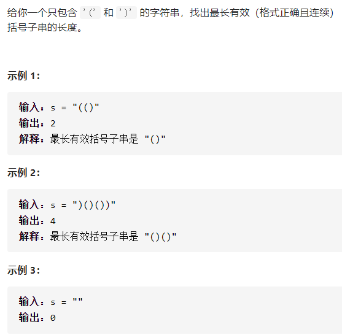

最长有效括号



详细思路

左括号放进去，右括号的话，和栈顶的左括号匹配，匹配时，如果为空，说明其实是不能匹配的，不用更新答案，但要把这个右括号作为新的栈底，如果没空，说明之前的匹配成功，计算

精确定义

i需要检测的元素

栈底：最后一个没有被匹配的右括号下标或者-1

栈顶：可以匹配的左括号下标

```c
class Solution {
public:
    int longestValidParentheses(string s) {
        int ans=0;
        int n=s.size();
        stack<int>stk;
        stk.push(-1);
        for(int i=0;i<n;i++){
            if(s[i]=='(')stk.push(i);
            else if(s[i]==')'){
                stk.pop();
                if(stk.empty())stk.push(i);
                else ans=max(ans,i-stk.top());
            }
        }
        return ans;
    }
}; 
```


踩过的坑

利用好栈底，如果pop后为空，说明来到了栈底，你想要把什么放进栈底？

详细思路

前i个，以i结尾的子串，有某种递推关系

精确定义

dpi 第0个元素到第i个元素的子串，以i结尾的有效括号最长长度

i需要判断的字符串下标

递推

\- - ( ) dp i =dp i-2  +2

\- ( ( ) ) dp i =dp[i-1]+2+dp[i-dp[i-1]-2]  解释：如果遇到))，同时s[i-dp[i-1]-1]==(，有  (())看出dp[i-1]+2，-看出dp[i-dp[i-1]-2]

初始化

dp 0=0

```c
class Solution {
public:
    int longestValidParentheses(string s) {
        int n=s.size();
        if(n<2)return 0;
        vector<int>dp(n);
        dp[0]=0;
        int ans=0;
        for(int i=1;i<n;i++){
            if(s[i]==')'&&s[i-1]=='(')dp[i]=(i-2>=0?dp[i-2]:0)+2;
            else if(s[i]==')'&&s[i-1]==')'&&i-dp[i-1]-1>=0&&s[i-dp[i-1]-1]=='('){
                dp[i]=dp[i-1]+2+(i-dp[i-1]-2>=0?dp[i-dp[i-1]-2]:0);
            }
            ans=max(ans,dp[i]);
        }
        return ans;
    }
};
```


踩过的坑

所有dp+string的题，最好dp0是第0个数，而不是空字符，然后空字符用 i-1>=0?dp[i-1]:0;