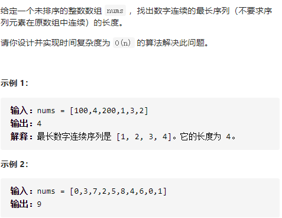

最长连续序列



详细思路

哈希集伪排序，枚举哈希集每个数num，如果num-1已经在哈希集，说明已经尝试过了continue，否则，从这个数开始，不断查看num+1在不在，在更新答案num++，

精确定义

hashNums哈希集数字

num已经考虑

ans1

ans

```c
class Solution {
public:
    int longestConsecutive(vector<int>& nums) {
        unordered_set<int>hashNums(nums.begin(),nums.end());
        int ans=0;
        for(int num:nums){
            if(hashNums.count(num-1))continue;
            int ans1=1;
            while(hashNums.count(num+1))ans1++,num++;
            ans=max(ans,ans1);
        }
        return ans;
    }
};


```


