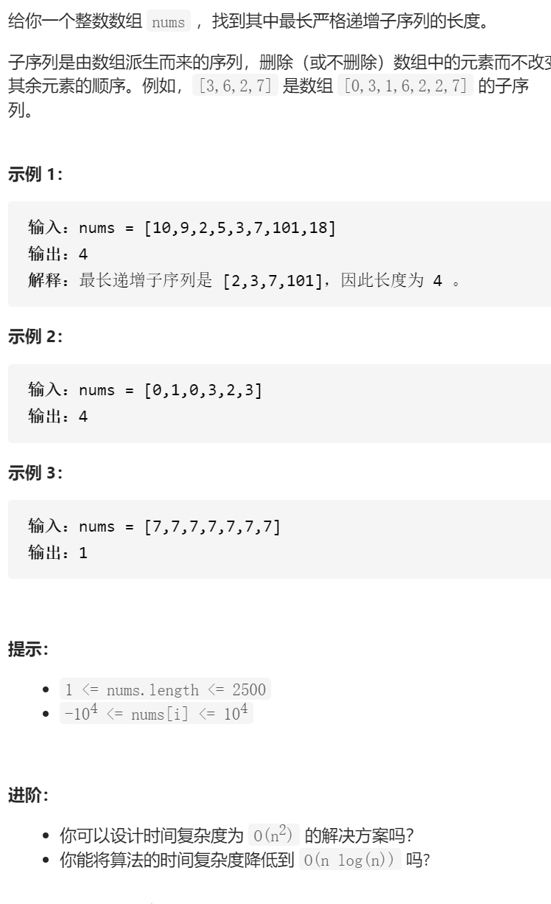

最长递增子序列



变量简洁正确完整思路

dp，dpi是0到i的以numi为结尾的最长严格递增长度，dp0时第一个

转移

10 9 2 5 3 7 101 18

dp i=max(dpj +1)dp i  if  numj<numi

初始化

dp 初始化1，至少都是1

```c
class Solution {
public:
    int lengthOfLIS(vector<int>& nums) {
        int n=nums.size();
        vector<int>dp(n,1);
        int ans=1;
        for(int i=1;i<n;i++){
            for(int j=0;j<i;j++){
                if(nums[j]<nums[i]){
                    dp[i]=max(dp[i],dp[j]+1);
                    ans=max(ans,dp[i]);
                }
            }
        }
        return ans;
    }
};
```


变量简洁正确完整思路

定义严格递增序列up，序列的长度就是答案，对于num，如果大于up.back，uppush_back

否则，不可能变长，但是可以贪心一下，找到upi大于num，用num取代，这样就可以让

整体上结尾更小，upi是第一个大于num的upi，用二分查找，[mid]》num左边找right=mid

[mid]《num右边找left=mid+1，==break，

踩过的坑

up长度不变的更新时，前面还不能小于，所以干脆找第一个大于等于的upi替换


```c
class Solution {
public:
    int lengthOfLIS(vector<int>& nums) {
        vector<int>up;
        up.push_back(nums[0]);
        int end=0;
        for(int num:nums){
            //cout<<num<<' '<<up[end]<<endl;
            if(num>up[end]){
                up.push_back(num);
                end++;
            }else {
                int left=0,right=end;
                while(1){
                    int mid=left+(right-left)/2;
                    if(left==mid){
                        if(up[left]>=num){
                            up[left]=num;
                        }else if(up[right]>=num){
                            up[right]=num;
                        }
                        break;
                    }
                    if(up[mid]>=num)right=mid;
                    else if(up[mid]<num)left=mid+1;
                }
            }
        }
        return up.size();
    }
};
```

