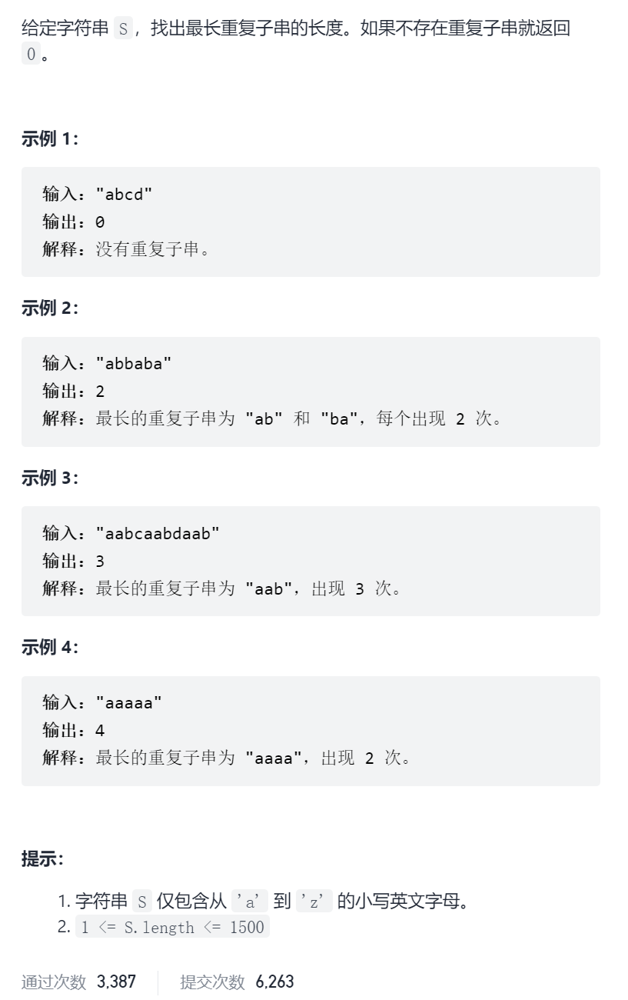
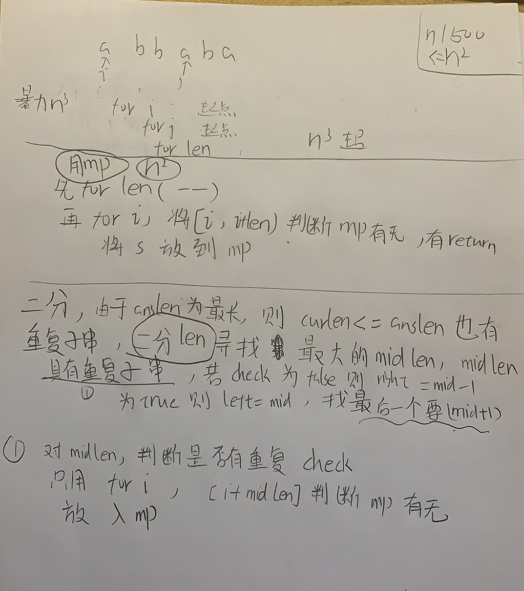

最长重复子串



抽象图一二ij



```c
class Solution {
public:
    int longestRepeatingSubstring(string s) {
        int n=s.size();
        for(int len=n-1;len>=2;len--){
            unordered_set<string>vis;
            for(int i=0;i+len<=n;i++){
                string s1=s.substr(i,len);
                if(vis.count(s1))return len;
                vis.insert(s1);
            }
        }
        return 0;
    }   
};


class Solution {
public:
    int longestRepeatingSubstring(string s) {
        int n=s.size();
        int left=1,right=n-1;
        while(left<right){
            int midLen=left+(right-left)/2+1;
            if(check(s,midLen))left=midLen;
            else right=midLen-1;
        }
        if(check(s,left)==false)return 0;
        return left;
    }
    bool check(string&s,int midLen){
        unordered_set<string>vis;
        for(int i=0;i+midLen<=s.size();i++){
            string s1=s.substr(i,midLen);
            if(vis.count(s1))return true;
            vis.insert(s1);
        }
        return false;
    }
};
```

