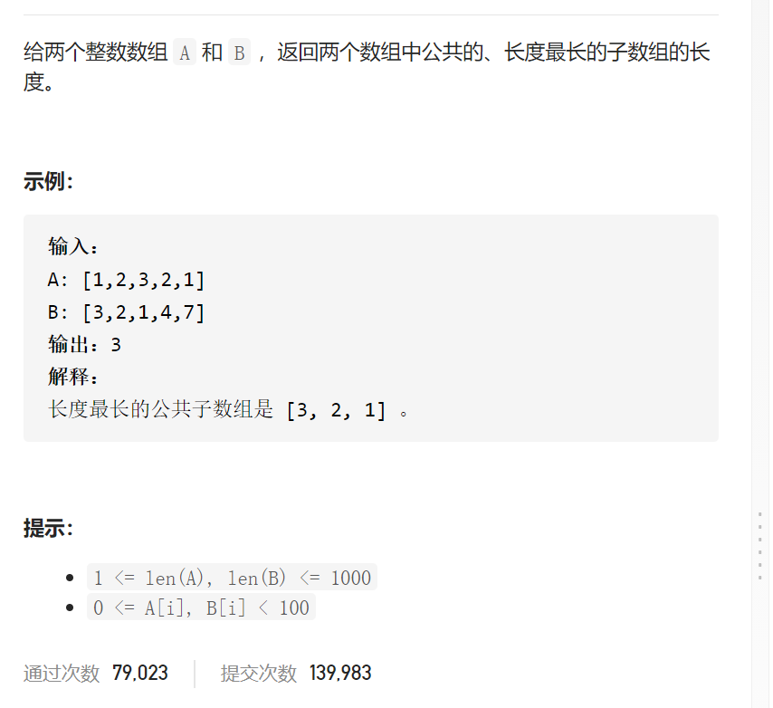
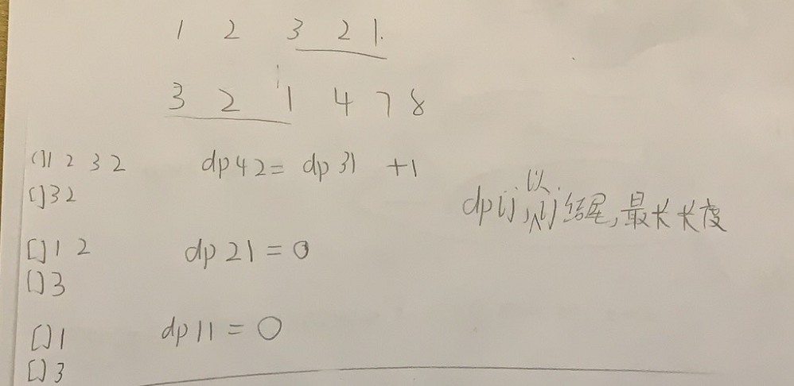
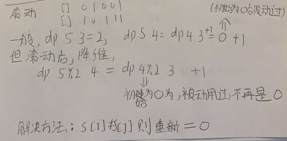

最长重复子数组



抽象图一二ij

10^3，暴力ij起点k前缀不行，需要n^2

注意到子序列（是连续），尝试动态规划




```c

class Solution {
public:
    int findLength(vector<int>& nums1, vector<int>& nums2) {
        int n=nums1.size(),m=nums2.size();
        nums1.insert(nums1.begin(),0);
        nums2.insert(nums2.begin(),0);
        vector<vector<int>>dp(n+1,vector<int>(m+1,0));
        int ans=0;
        for(int i=1;i<=n;i++){
            for(int j=1;j<=m;j++){
                if(nums1[i]==nums2[j]){
                    dp[i][j]=dp[i-1][j-1]+1;
                    ans=max(ans,dp[i][j]);
                }
            }
        }
        return ans;
    }
};
```

压缩



```c
class Solution {
public:
    int findLength(vector<int>& nums1, vector<int>& nums2) {
        int n=nums1.size(),m=nums2.size();
        nums1.insert(nums1.begin(),0);
        nums2.insert(nums2.begin(),0);
        vector<vector<int>>dp(2,vector<int>(m+1,0));
        int ans=0;
        for(int i=1;i<=n;i++){
            for(int j=m;j>=1;j--){
                if(nums1[i]==nums2[j]){
                    dp[i%2][j]=dp[(i-1)%2][j-1]+1;
                    ans=max(ans,dp[i%2][j]);
                    //cout<<i<<' '<<j<<' '<<dp[i%2][j]<<endl;
                }else dp[i%2][j]=0;
            }
        }
        return ans;
    }
};

```


