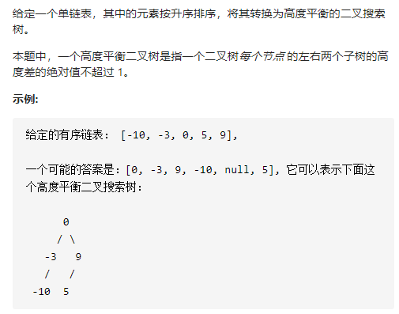

有序链表转换成二叉搜索树



详细思路

递归，想要高度平衡，就应该找到中点，形参leftright是形成二叉搜索树的节点下标，head是数据，找到中点，要么省时间用vector，要么省空间用快慢指针找到中点

精确定义

dfs，形参leftright数据nums，生成高度平衡二叉搜索树，left>right返回空，最后返回

```c
class Solution {
public:
    TreeNode* sortedListToBST(ListNode* head) {
        if(!head)return nullptr;
        vector<int>nums;
        while(head){
            nums.push_back(head->val);
            head=head->next;
        }
        return dfs(0,nums.size()-1,nums);
    }
    TreeNode* dfs(int left,int right,vector<int>&nums){
        if(left>right)return nullptr;
        int mid=left+(right-left)/2;
        TreeNode*leftTree=dfs(left,mid-1,nums);
        TreeNode*rightTree=dfs(mid+1,right,nums);
        return new TreeNode(nums[mid],leftTree,rightTree);
    }
};
```

详细思路

要么省空间，找中点用快慢指针，递归，形参是链表结点left和right，重要的是，right是链表的最后一个节点的下一位，这样初始值就是nullptr不用遍历，dfs可以生产left和right一棵高度平衡二叉搜索树

精确定义

dfs生产left和right的一棵树，left==right为空边界返回，最后返回


```c
class Solution {
public:
    TreeNode* sortedListToBST(ListNode* head) {
        return dfs(head,nullptr);
    }
    TreeNode*dfs(ListNode*left,ListNode*right){
        if(left==right)return nullptr;
        ListNode* root=findMid(left,right);
        TreeNode*leftTree=dfs(left,root);
        TreeNode*rightTree=dfs(root->next,right);
        return new TreeNode(root->val,leftTree,rightTree);
    }
    ListNode* findMid(ListNode*head,ListNode*tail){
        ListNode*fast=head,*slow=head;
        while(fast!=tail&&fast->next!=tail){
            fast=fast->next->next;
            slow=slow->next;
        }
        return slow;
    }
};
```


