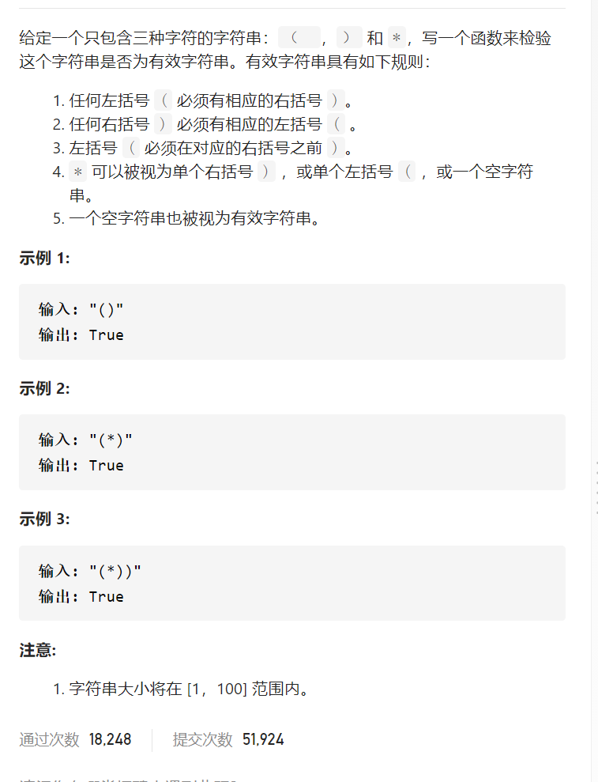

有效的括号字符串




```c
class Solution {
public:
    bool checkValidString(string s) {
        int i=0,j=0;
        for(char c:s){
            if(c=='(')i++,j++;
            else if(c=='*')i--,j++;
            else if(c==')')i--,j--;
            if(j<0)return false;
            //cout<<c<<' '<<i<<' '<<j<<endl;
        }
        i=0,j=0;
        for(int k=s.size()-1;k>=0;k--){
            if(s[k]==')')i++,j++;
            else if(s[k]=='*')i--,j++;
            else if(s[k]=='(')i--,j--;
            if(j<0)return false;
        }
        return i<=0&&j>=0;
    }
};
```

