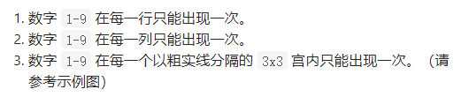
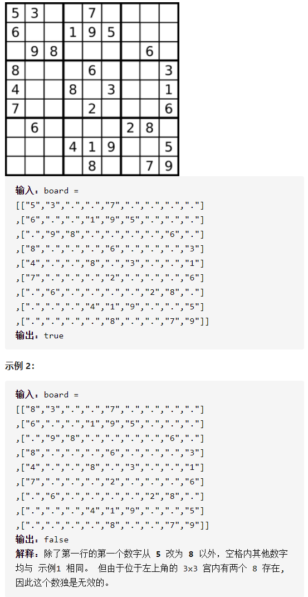

有效的数独



详细思路

遍历每个格子，每遇到一个格子，检查行、列、盒是否出现过，出现过false，没有标记为1，检查方法是放在9 9二维数组row、col、box是行下标、列下标、盒下标对应的值有没有出现过，盒下标=i/3*3+j/3

精确定义

row、col、box二维99数组，行、列、盒下标对应的数有没有出现过

i需要检查第i行第j列的字符

```c
class Solution {
public:
    bool isValidSudoku(vector<vector<char>>& board) {
        vector<vector<int>>row(9,vector<int>(9,0));
        vector<vector<int>>col(9,vector<int>(9,0));
        vector<vector<int>>box(9,vector<int>(9,0));
        for(int i=0;i<9;i++){
            for(int j=0;j<9;j++){
                if(board[i][j]=='.')continue;
                int num=board[i][j]-'1';
                if(row[i][num]==0&&col[j][num]==0&&box[i/3*3+j/3][num]==0){
                    row[i][num]=1;
                    col[j][num]=1;
                    box[i/3*3+j/3][num]=1;
                }else return false;
            }
        }
        return true;
    }   
};
```


踩过的坑

​        int num=board[i][j]-'1';

i/3*3+j/3