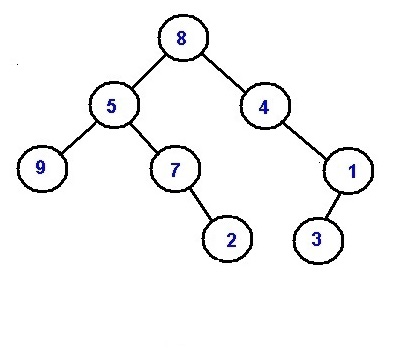
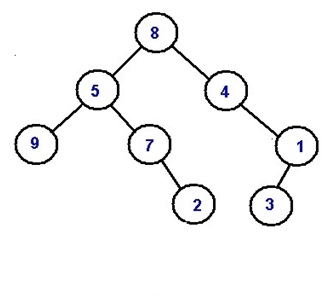

求[二叉树](https://so.csdn.net/so/search?from=pc_blog_highlight&q=二叉树)两个节点之间的距离

**Problem statement:**

**问题陈述：**

Given a [binary tree](https://www.includehelp.com/data-structure-tutorial/binary-tree-definition-and-its-properties.aspx), and two node values your task is to **find the minimum distance between them**.

给定一棵[二叉树](https://www.includehelp.com/data-structure-tutorial/binary-tree-definition-and-its-properties.aspx)和两个节点值，您的任务是**找到它们之间的最小距离** 。

Node values are unique.

节点值是唯一的。

**Example:**

**例：**



Let the two nodes to be **9 and 2**, their min distance is **3**, In case of **4 and 3** their min distance is **2**.

设两个节点为**9和2** ，它们的最小距离为**3** ，在**4和3**的情况下，它们的最小距离为**2** 。

**Solution:**

**解：**

One naïve idea can be searching for either of the nodes using [BFS](https://www.includehelp.com/data-structure-tutorial/breadth-first-search-bfs-of-a-graph.aspx). Once either of the nodes is found, corresponding node is marked. We start searching for the other node incrementing distance. But one problem is result always is not guaranteed to be minimum.

一个天真的想法可以是使用[BFS](https://www.includehelp.com/data-structure-tutorial/breadth-first-search-bfs-of-a-graph.aspx)搜索其中一个节点。 一旦找到任何一个节点，就标记相应的节点。 我们开始搜索其他节点递增距离。 但是一个问题是结果总是不能保证最小。

Rather what actually should come to your mind is what can be closest node for both the target nodes (distance between those nodes that are to be found). The answer will be lowest common ancestor. So, we actually need to find the lowest common ancestor of two target nodes. Then, we can think the LCA to be root and the target nodes exist in two different branches. **(Example 1)**

实际上，您真正想到的是两个目标节点都可以是最近的节点(要找到的那些节点之间的距离)。 答案将是最低的共同祖先。 因此，我们实际上需要找到两个目标节点的最低共同祖先。 然后，我们可以认为LCA是根，目标节点存在于两个不同的分支中。 **(示例1)**

Or there can be situation that both the target nodes exists on same root to leaf path that means one of the two target nodes itself is LCA. **(Example 2)**

或者可能存在两个目标节点都位于同一根到叶路径的情况，这意味着两个目标节点本身就是LCA。 **(示例2)**

However rest of our job is two find distance of respective target nodes from the LCA.

但是，我们剩下的工作是找到各个目标节点到LCA的两个距离。

Let the distances to be **distance1** and **distance2** respectively.

让**距离**分别为**distance1**和**distance2** 。

Then the minimum distance between the two target nodes will be **= distance1+distance2**

然后，两个目标节点之间的最小距离将为**= distance1 + distance2**

**How to find LCA?**

**如何找到LCA？**

Can be done using ***preorder\*** traversal.

可以使用***预习\***遍历来完成。

**Pre-requisite:**

**先决条件：**

Tree root, target node data values a, b

树根 ，目标节点数据值a ， b

```php
    FUNCTION LCA (root, a, b)


        //base case


        IF(!root)


            return NULL;


 


        IF(root->data==a || root->data==b) //it ensures to root to be LCA


            return root;


 


        Node* l=findlowestancestor(root->left,a,b);


        Node* r=findlowestancestor(root->right,a,b);


 


        if(l && r) //this can only happen incase of LCA be root


            return root;


 


        return (l==NULL ?r:l); //NOT NULL one between l and r which contains LCA node


    END FUNCTION
```

After finding the LCA we compute the distance separately for two nodes. This can be done by level order traversal finding number of levels between target node and root (LCA).

找到LCA之后，我们分别计算两个节点的距离。 这可以通过遍历级别顺序遍历来找到目标节点和根(LCA)之间的级别数来完成。

**Example with explanation:**

**带有说明的示例：**



**Example 1:**

**范例1：**

```csharp
    Target nodes:


    9 and 2


 


    LCA:


    Node with value 5


    Distance1: //distance between 5 and 9


    1


    Distance2: //distance between 5 and 2


    2


 


    Their min distance is 1+2=3
```

**Example 2:**

**范例2：**

```csharp
    Target nodes: 


    4 and 3


 


    LCA:


    Node with value 4 (first target node itself)


    Distance1: //distance between 4 and 4


    0


    Distance2: //distance between 4 and 3


    2


 


    Their min distance is 0+2=2
```

**C++ implementation:**

**C ++实现：**

```php
#include <bits/stdc++.h>


using namespace std;


 


class Node{ //tree node


	public:


	int data;


	Node *left;


	Node *right;


};


 


//finding lowest common ancestor


Node* findlowestancestor(Node* root,int a,int b){


	if(!root)


		return NULL;


 


	if(root->data==a || root->data==b)


		return root;


 


	Node* l=findlowestancestor(root->left,a,b);


	Node* r=findlowestancestor(root->right,a,b);


 


	if(l && r)


		return root;


 


	return (l==NULL ?r:l);


}   


 


//finding distance between root(LCA) and target node


int height(Node* root, int a){


	//base cases


	if(root==NULL)


		return 0;


 


	if(root->data==a)


		return 0;


 


	//level order 


	queue<Node*> q;


	q.push(root);


	q.push(NULL);


	int height=0;


	while(!q.empty()){


		Node* temp=q.front();


		q.pop();


		


		if(!temp){


			if(!q.empty()){


				q.push(NULL);


			}


			height++;


		}


		else{


			if(temp->data==a)


				return height;


			if(temp->left)


				q.push(temp->left);


			if(temp->right)


				q.push(temp->right);


		}


	}


 


	return height;


}


 


int findDist(Node* root, int a, int b)


{


	Node* t=findlowestancestor(root,a,b); 


	int p=height(t,a);


	int q=height(t,b);


 


	return p+q;


}


 


//creating new nodes


Node* newnode(int data){  


	Node* node = (Node*)malloc(sizeof(Node)); 


	node->data = data; 


	node->left = NULL; 


	node->right = NULL; 


	return(node); 


} 


 


int main() { 


	//**same tree is builted as shown in example**


	cout<<"tree in the example is build here"<<endl;


	//building the tree like as in the example


	Node *root=newnode(8); 


	root->left= newnode(5); 


	root->right= newnode(4); 


	root->right->right=newnode(1);


	root->right->right->left=newnode(3);


	root->left->left=newnode(9); 


	root->left->right=newnode(7);


	root->left->right->right=newnode(2);


 


 


	cout<<"Example 1......"<<endl;


	cout<<"Miniimum distance between 9 and 2\n";


	cout<<findDist(root,9,2)<<endl;


	cout<<"Example 2......"<<endl;


	cout<<"Miniimum distance between 4 and 3\n";


	cout<<findDist(root,4,3);


	return 0; 


}
```

**Output**

**输出量**

```sql
tree in the example is build here


Example 1......


Miniimum distance between 9 and 2


3


Example 2......


Miniimum distance between 4 and 3


2 
```

> 翻译自: https://www.includehelp.com/icp/minimum-distance-between-two-given-nodes-of-a-binary-tree.aspx

求二叉树两个节点之间的距离

