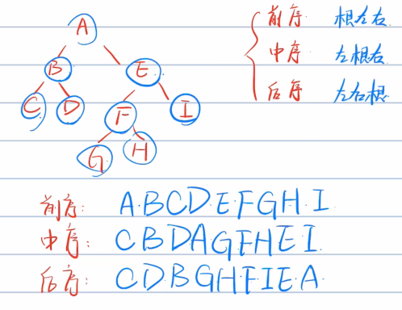
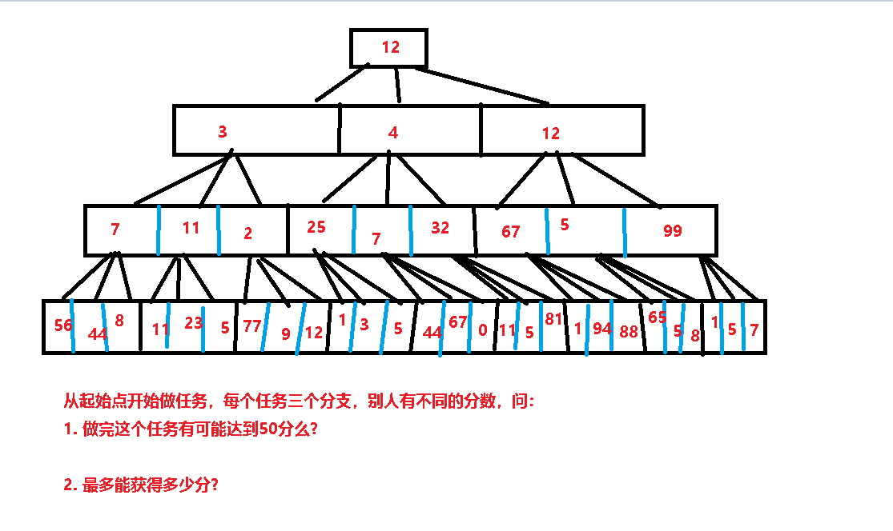

- 前/中/后序遍历

  ## 介绍

  

  ## 应用场景

  - 前序
    、**可以很方便地形成一条搜索路径**
    、**可以用来实现目录结构的显示**：如果是文件夹，先输出文件夹名，然后再依次输出该文件夹下的所有文件(包括子文件夹)，如果有子文件夹，则再进入该子文件夹，输出该子文件夹下的所有文件名。这是一个典型的先序遍历过程。
    、**第一次访问就输出数据**
    、**适合静态访问**
  - 中序
    、**遍历BST的时候可以得到一个有序序列**
    、**对于二分搜索树，输出结果是有序的**
    、**适合顺序输出结果**
  - 后序
    、**可以用来计算一颗算数表达式树**
    、**可以用来统计某个文件夹的大小（该文件夹下所有文件的大小）**：若要知道某文件夹的大小，必须先知道该文件夹下所有文件的大小，如果有子文件夹，若要知道该子文件夹大小，必须先知道子文件夹所有文件的大小。这是一个典型的后序遍历过程。
    、**对节点操作时必访问过其子节点**
    、**适合进行破坏性操作（删除节点）**

  # DFS/BFS

  ## 介绍

  DFS：（深度优先搜索 depth-first search）
  BFS：（广度优先搜索 breadth-first search）
  

  ## 不同点、应用场景

  - DFS
    、直接用递归栈的话，有爆栈的风险（直接用递归的话DFS更好写）
  - BFS
    、适用于：层序遍历，最短路径

## 讲人话

至于说所谓的深度和广度，让我们用”人话”来理解一下：

**什么是DFS深度优先搜索？**
用一个常用的思路来表述：递归就是一个标准的深度搜索。一层一层往下走。但是有些时候在算法中经常会遇到一条路走不通的情况，那么我们就返回上一层换条路走。

拿一个游戏作比喻：假如有一个迷宫，其方式是一层门一层门的往里走，目标是最终走出这个迷宫。具体的游戏方式起始房间有9个门，我们可以任选其一进入，下一个房间也会有9个门，直到最后一层会要么有出去的大门，要么是一堵墙。

在不开挂的情况下想要走出这个迷宫通常情况下只能一个个试，一层层往下随机走，直到最后一层如果出去了就出去了，但是如果没出去那么返回上一层，继续碰运气。
用数学的思维来讲：起始房间是最开始的那个，也就是度是0的那个。而往下走的话下一个房间是度是1的，下下一个房间是度是2的。依次类推。。
而如果真有这么个题目，我们也可以用递归+回溯的方式来实现。
所以说我们常用的递归，回溯都属于DFS，也就是深搜。
而深搜通常是可以知道我们能不能做到某事，而广搜一般还能知道做到某事的最小路径。

**什么是BFS广度优先搜索？**
相对于DFS的一层一层往深了去走，广搜更像是每一层每一个选择都选了。依旧拿那个游戏做例子：我们可以在起始入口就分出9个线程，都走一遍。往下也是依次这样，反正人多呗。

刚刚讲的迷宫，不管是深搜还是广搜，我们都可以得到答案，而两者的优缺点：

- 深搜：可以告诉我们能不能过，而且只需要一个人去挨个尝试。
- 广搜：不仅告诉我们能不能过，而且还可以把所有能过的路线都记录下来，甚至还可以有很多附加的功能。比如说能通过的门牌号最小的路径，最靠左/右的路径等等。但是相对于深搜是要更加复杂一点的。

当然了，上面是很简单的说法，比如说深搜也可以在找到通过的路径以后不出去继续挨个试。
毕竟两种搜索方法本质都是穷竭列举所有的情况。

**实际选择哪种方法？**
我们在具体是算法题目上选择哪种搜索方法还是要结合实际的，比如我上面说的如果问题是能不能，那么深搜大部分就可以满足了，但是如果涉及到了**最短/最小/最大**等，广搜比较适合。

形象点说：`DFS 是线，BFS 是面；DFS 是单打独斗，BFS 是集体行动。`

其实我觉得两者的应用场景差不多：都是在不断的做选择的情境下使用。

下面简单出两个比较有针对性的题目：

这个题虽然很简单，但是可以很直观的表示深搜和广搜的用法区别了。

比如第一个问题，能不能达到50分，我们可以采用深搜的方式，递归往下走，正常先都走第一个结果：12+3+7+56 = 78.
因为78>50.所以结果是有可能得到50分，这个题就做完了。（当然了这个是最好的情况，如果第一条路不行，那么要回退上一步，换一条往下走，比如12+3+7+44.再不行就是12+3+7+8…深搜的最坏结果就是变成了广搜）

但是第二个问题，最大获取多少分，那么就要每一条路都走一遍，获取其中最大的值，那么这种方式就是广搜。

## 代码书写思路

因为我是java开发，所以这里简单说一下两个搜索方式在java中实现：
（DFS深度优先搜索）：一个标准使用方式就是递归。而递归其实就是隐式栈，所以我们也可以用显式栈来实现。这里栈的先进后出其实是实现回退上一步的方式。不管是显示栈调用还是隐式的方法递归都可以。
（BFS广度优先搜索）：这个咋说呢，每一层都记录，每一条路走要走一遍，其实用队列就可以了。

当然了具体地代码书写就更复杂了，要根据情况来写，所以我这里也不班门弄斧了。

两个例题来理解一下：

- [LeetCode 100. 相同的树](https://leetcode-cn.com/problems/same-tree/)，答案参考：[题解](https://leetcode-cn.com/problems/same-tree/solution/tao-pan-feng-dfs-bfs-by-a1697752105-t1q9/)
- [LeetCode 101. 对称二叉树](https://leetcode-cn.com/problems/symmetric-tree/)，答案参考：[题解](https://leetcode-cn.com/problems/symmetric-tree/solution/tao-pan-feng-dfs-bfs-by-a1697752105-p0u7/)