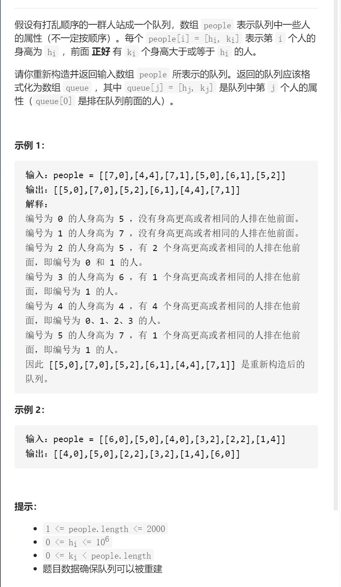

根据升高重建队列



变量简洁正确完整思路

身高和k两个考虑的维度，一定要先确定一个维度升高，降序排列，

70 71 61 50 52 44，61可以放心插到70后面，使其满足k，50可以插到最前面，使其满足k，52可以插到下标为2，使其满足k，总之身高降序后，正向遍历按k插入就行，使用链表快速

```c
class Solution {
public:
    static bool cmp(const vector<int>lhs,const vector<int>rhs){
        if(lhs[0]==rhs[0])return lhs[1]<rhs[1];
        else return lhs[0]>=rhs[0];
    }
    vector<vector<int>> reconstructQueue(vector<vector<int>>& people) {
        sort(people.begin(),people.end(),cmp);
        list<vector<int>>que;
        for(int i=0;i<people.size();i++){
            int targetIndex=people[i][1];
            list<vector<int>>::iterator it=que.begin();
            for(int i=0;i<targetIndex;i++){
                it++;
            }
            que.insert(it,people[i]);
        }
        return vector<vector<int>>(que.begin(),que.end());
    }
};
```

踩过的坑

50 52应该50在前，否则先52，然后50插入会导致52出错

​      int targetIndex=people[i][1];

​      list<vector<int>>::iterator it=que.begin();

​      for(int i=0;i<targetIndex;i++){

​        it++;

​      }

链表通过下标转化为迭代器来插入，list的迭代器是双向而不是随机访问，不能+int

  static bool cmp(const vector<int>lhs,const vector<int>rhs){

​    if(lhs[0]==rhs[0])return lhs[1]<rhs[1];

​    else return lhs[0]>=rhs[0];

  }

 return vector<vector<int>>(que.begin(),que.end());

