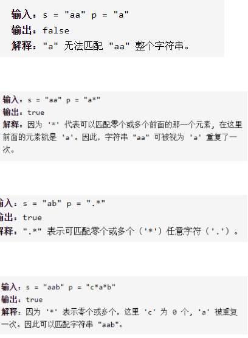

正则表达式匹配

详细思路

s前i个字符和p前j个字符具有某种转化关系

精确定义

dp ij s中0到i-1的字符串等不等于p中0到j-1的字符串转换后的结果

状态转移

\- - - 1

\- - - 1(.)

dp ij =dp i-1 j-1

\- - - 1

\- - 2 *

dpi j=dp i j-2

\- - -    1

\- - 1(.)  *

dpi j=dp i j-2（不要匹配）||dpi-1 j（要匹配）

初始化

dp 0 0=false;

\- * - *

dp 0 j=dp0 j-2

```c
class Solution {
public:
    bool isMatch(string s, string p) {
        int n=s.size(),m=p.size();
        if(n==0||m==0)return false;
        bool dp[n+1][m+1];
        memset(dp,0,sizeof(dp));
        //s中0到-1，p中0到-1个字符串匹配，也就是空字符串
        dp[0][0]=true;
        for(int j=2;j<=m;j++){
            if(p[j-1]=='*'){
                //s中0到-1，p中0到1，可以从0到-1转换
                dp[0][j]=dp[0][j-2];
            }
        }
        //dp ij是s中0到i-1的字符串等不等于p中0到j-1的字符串
        //s i-1 p j-1是s中第i、p中第j个字符
        for(int i=1;i<=n;i++){
            for(int j=1;j<=m;j++){
                if(s[i-1]==p[j-1]||p[j-1]=='.'){
                    dp[i][j]=dp[i-1][j-1];
                }
                else if(p[j-1]=='*'){
                    if(s[i-1]!=p[j-2]&&p[j-2]!='.')dp[i][j]=dp[i][j-2];
                    else dp[i][j]=dp[i][j-2]||dp[i-1][j];
                }
            }
        }
        return dp[n][m];
    }
};
```


踩过的坑

10*可以匹配1

dp0 0 是空字符串，dpi j只能第0到第i-1 j-1个字符