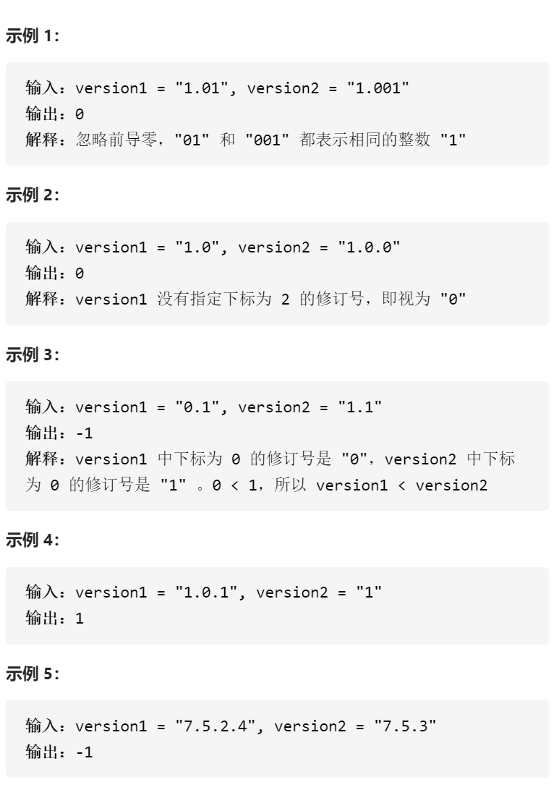
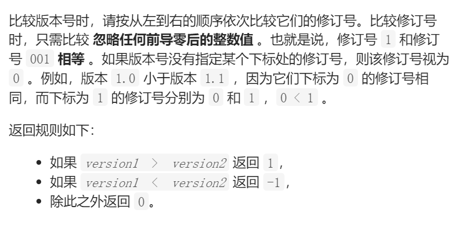

比较版本号



变量简洁正确完整思路

cur1cur2同时遍历，两人版本号值为num1num2=0，只要没到.就num1=num1*10+

s[cur1]-'0'，cur++，如果cur1或cur2到n1或n2则num1或num2就是0，while中

一旦num1num2不同立刻返回

精确定义

cur1cur2

num1num2

```c
class Solution {
public:
    int compareVersion(string version1, string version2) {
        int n1=version1.size(),n2=version2.size();
        int cur1=0,cur2=0;
        while(cur1<n1||cur2<n2){
            int num1=0,num2=0;
            while(cur1<n1&&version1[cur1]!='.'){
                num1=num1*10+version1[cur1]-'0';
                cur1++;
            }
            while(cur2<n2&&version2[cur2]!='.'){
                num2=num2*10+version2[cur2]-'0';
                cur2++;
            }
            if(num1<num2)return -1;
            if(num1>num2)return 1;
            cur1++,cur2++;
        }
        return 0;
    }
};
```

