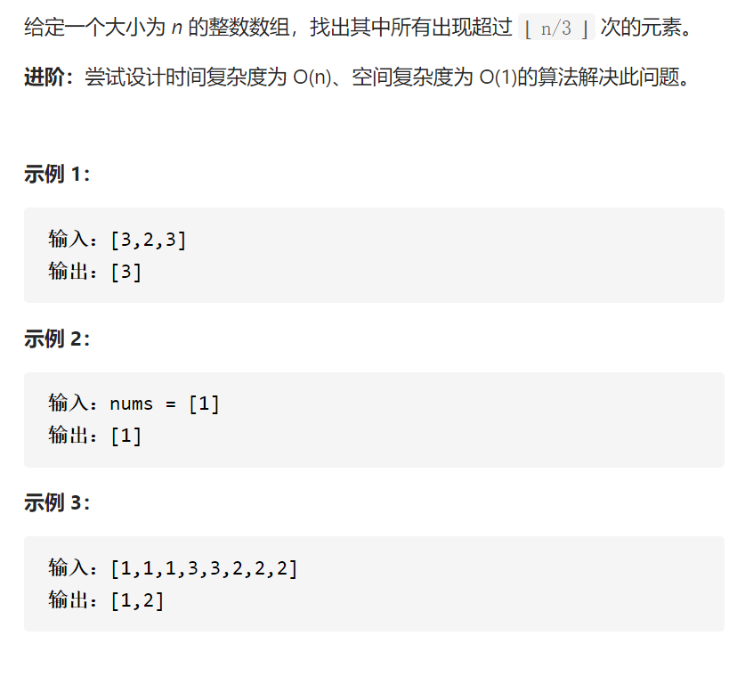

求众数II

摩尔投票法，选出至多m个代表

变量简洁正确完整思路

对于num，找到对应的候选人cands[i]，cnts[i]++，如果num找不到cands[i]，从cnt[j]找到cnt[j]==0的进行取代，如果找不到cnt[j]==0的，对cnts[j]所有--，计数时，对cands的候选人计数，先cands[i]对应的cnts[i]=0然后遍历所有num进行cnt计数，遍历所有cands的cnt超过的更新答案

精确定义

cands候选人

cnts计数

nums选票，对应候选人

```c
class Solution {
public:
    vector<int> majorityElement(vector<int>& nums) {
        vector<int>cands,cnts,ans;
        cands.assign(2,nums[0]);
        cnts.assign(2,0);
        for(int num:nums){
            bool findCands=false;
            for(int i=0;i<cands.size();i++){
                if(cands[i]==num){
                    cnts[i]++;
                    findCands=true;
                    break;
                }
            }
            if(!findCands){
                bool findCnt=false;
                for(int i=0;i<cands.size();i++){
                    if(cnts[i]==0){
                        cands[i]=num;
                        cnts[i]++;
                        findCnt=true;
                        break;
                    }
                }
                if(!findCnt){
                    for(int i=0;i<cands.size();i++){
                        cnts[i]--;
                    }
                }
            }
        }
        cnts.assign(2,0);
        for(int num:nums){
            for(int i=0;i<cnts.size();i++){
                if(cands[i]==num){
                    cnts[i]++;
                    break;
                }
            }
        }
        for(int i=0;i<cnts.size();i++){
            if(cnts[i]>nums.size()/3){
                ans.push_back(cands[i]);
            }
        }
        return ans;
    }
};

```

