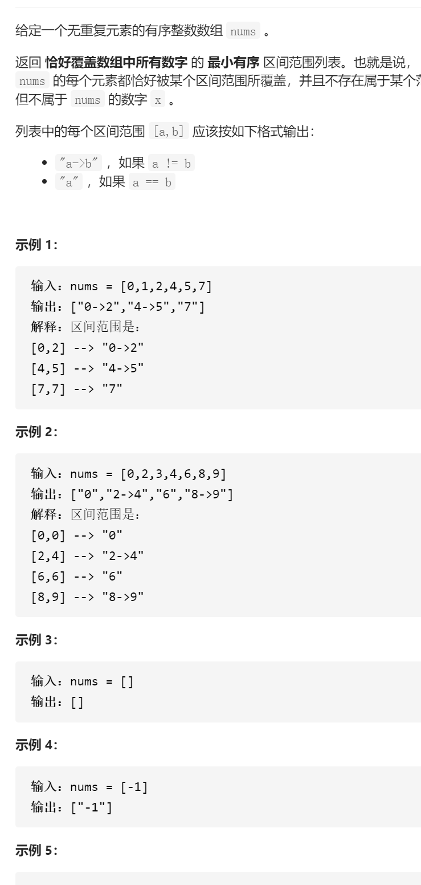

汇总区间




变量简洁正确完整思路

对于i，j=i+1，j是需要判断，i是已经判断，while(num==num+1)j++ 更新

numi->numj-1  

```c
class Solution {
public:
    vector<string> summaryRanges(vector<int>& nums) {
        int i=0,j=1,n=nums.size();
        vector<string>ans;
        while(j<n){
            while(j<n&&nums[j]==nums[j-1]+1)j++;
            if(j==i+1){
                ans.push_back(to_string(nums[i]));
            }else {
                string ans1;
                ans1+=(to_string(nums[i]));
                ans1+="->";
                ans1+=to_string(nums[j-1]);
                ans.push_back(ans1);
            }
            i=j;
            j++;
        }
        if(i<n){
            string ans1;
            ans.push_back(to_string(nums[i]));
        }
        return ans;
    }
};
```

