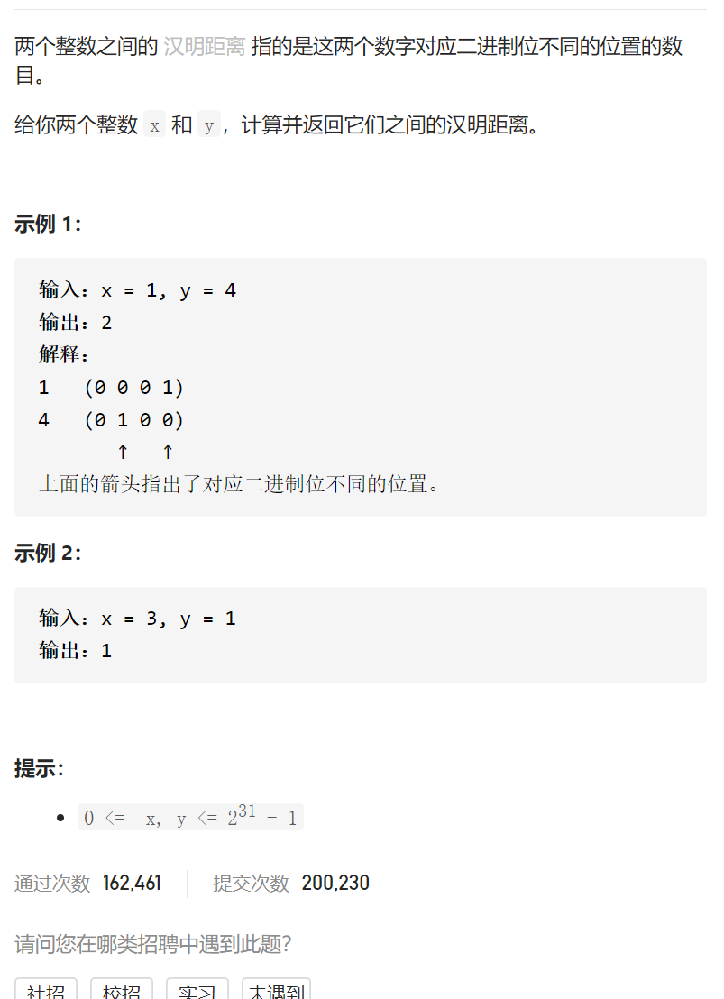

汉明距离



抽象固定维护寻找

比较32次，每次^==1则cnt++

```c
class Solution {
public:
    int hammingDistance(int x, int y) {
        int ans=0;
        for(int i=0;i<32;i++){
            if(((x&0b1)^(y&0b1))==1)ans++;
            x>>=1;
            y>>=1;
        }
        return ans;
    }
};
```

踩过的坑

((x&0b1)^(y&0b1))==1

优先级大于小于等于更快，位运算更慢，逻辑&& ||最慢

[image:1629385857090.png]

抽象固定维护寻找

利用n&(n-1)可以删除低位1，先x^y得到不同的位置的1，然后用n&(n-1)计算1个数

```c
class Solution {
public:
    int hammingDistance(int x, int y) {
        int ans=0;
        int n=x^y;
        while(n){
            n&=(n-1);
            ans++;
        }
        return ans;
    }
};
```

