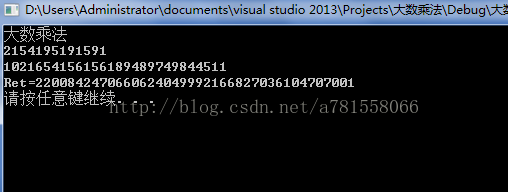
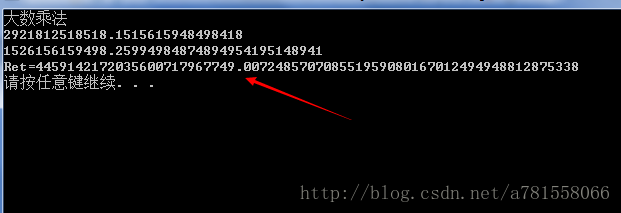

```
一.大数乘法

我们知道，要运算两个数的乘法，c、c++语言里有专门的运算符*。但是当两个数超过一定的范围时，用普通的运算符会产生溢出，并不能得到正确的结果。如何进行运算呢？

      首先，要想保存一个大数，用正常的整形或浮点类型是不够的。所以我们可以采用字符串的形式对大数进行保存，然后编写算法，模拟乘法运算过程即可。

1.第一个问题：两个数字运算结果至多用多少位的字符串保存呢？

两个4位数相乘，最大值为9999*9999它的位数小于10000*10000的位数9位，所以两个数字相乘的结果至多不超过两数位数的和

2.第二个问题：运算的过程怎么模拟？

        比如：我们可以先进行类乘和累加，把结果保存到相应的字符里，然后进行进位

1  2  3  4

            1  2  3

--------------------

        3  6   9  12             //一次类乘

   2  4   6   8

1 2  3  4

--------------------------

1 4 10 16 17 12             //累加  

1 5   1   7   8    2            //进位
```


但是，这里会出现的问题就是，如果当两个数的位数特别大是，先进行类乘累加，由于无符号字符能保存的最大值也只有255，后进行进位处理时，有可能字符保存的值已经溢出。所以，在进行处理时要一次类乘后进行进位，然后累加。


处理完思路后，编写代码会变得很轻松。

```c
void bignum(char *num1, char *num2)
{
	int length1 = strlen(num1);
	int length2 = strlen(num2);
	int i, l;
	char *res = (char *)malloc(sizeof(char)*(length1 + length2)); //开辟相应内存
	memset(res, 0, sizeof(char)*(length1 + length2));
	for (i = length1 - 1; i >= 0; i--)
	for (l = length2 - 1; l >= 0; l--)
	{
		res[i + l + 1] += (num1[i] - '0')*(num2[l] - '0'); 类乘完累加
		res[i + l] += res[i + l + 1] / 10;    //马上进行进位
		res[i + l + 1] %= 10;
	}
	int count = 0;
	while (res[count] == 0)  //由于保存的结果是从右向左的，所以要消除左部分的0；
	{
		count++;
	}
	char* ret = (char *)malloc(sizeof(char)*(length1 + length2 + 2));
	memset(ret, 0, sizeof(char)*(length1 + length2 + 2));
	for (l = 0, i = count; i < length1 + length2; l++, i++)  //非0部分赋给ret
	{
		ret[l] = res[i] + '0';
	}
	printf("Ret=%s\n", ret);
	free(res);
	free(ret);
}
```

结果如图：




二：实现浮点数。

实现浮点数相乘，其实和整数差不多。只不过先得把浮点数转化为整数，并记录两个数小数点的位数和，然后再得到的整数上加上相应的小数点即可


```c
void bignum_float(char *str1, char *str2)
{
	int length1 = strlen(str1);
	int length2 = strlen(str2);
	int flnum = -1;   //大数1的小数点位数
	int flnum2 =-1;   //数2的小数点位数
	char num1[500] = { 0 };
	char num2[500] = { 0 };
	int i, l;
	for (i=0,l=0; l < length1;i++,l++)
	{
		if (str1[l] == '.') //遇到小数点后 开始加一
		{
			flnum++;
			i--;
			continue;
		}
		if (flnum!=-1) flnum++; //统计小数点后的位数，由于会多加一次，所以初始值为-1
		num1[i] = str1[l];  //保存到新的数组里
	}

	for (i = 0,l = 0; l < length2; i++, l++)
	{
		if (str2[l] == '.')
		{
			flnum2++;
			i--;
			continue;
		}
		if (flnum2!=-1) flnum2++;
		num2[i] = str2[l];
	}
	if (flnum!=-1) length1 -= 1;   //如果数字存在小数点，则转化为整数后对应的长度-1
	if (flnum2!=-1) length2 -= 1;
	flnum = flnum + flnum2;
	char *res = (char *)malloc(sizeof(char)*(length1 + length2));
	memset(res, 0, sizeof(char)*(length1 + length2));
	for (i = length1-1; i>=0;i--)
	for (l=length2-1; l >= 0; l--)
		{
			res[i+l+1]+=(num1[i] - '0')*(num2[l] - '0');
			res[i + l] += res[i + l + 1] / 10;
			res[i + l + 1] %= 10;
		}
	int count = 0;
	while (res[count] == 0)
	{
		count++;
	}
	char* ret =(char *)malloc(sizeof(char)*(length1 + length2+2));
	memset(ret, 0, sizeof(char)*(length1 + length2 + 2));
	for (int n=0,l = 0,i=count; i < length1 + length2; l++, i++,n++)
	{		
		if (n == length1 + length2 -count-flnum)   //在结果对应的位置加上小数点
		{
			ret[l] = '.';
			i--;
			continue;
		}
		ret[l] = res[i] + '0';
	}
	 
	printf("Ret=%s\n",ret);
	free(res);
	free(ret);

}
```

结果：

****


